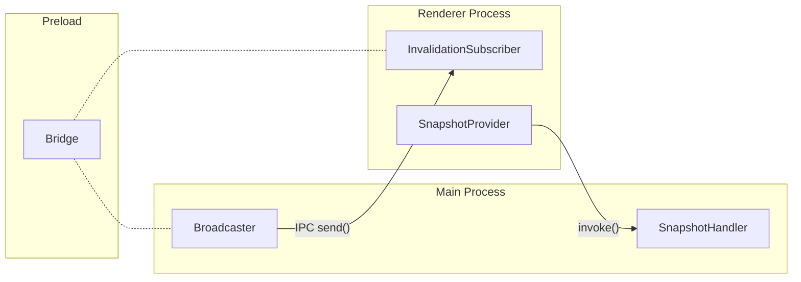

**@statesync/electron**

***

# @statesync/electron

@statesync/electron — Electron IPC transport for state-sync.

Provides main-process, preload, and renderer-process primitives for
revision-based state synchronization over Electron's IPC channels.

Architecture overview:

**Main process** (`main.ts`):
- [createElectronBroadcaster](functions/createElectronBroadcaster.md) — pushes invalidation events to renderers
- [createElectronSnapshotHandler](functions/createElectronSnapshotHandler.md) — handles snapshot requests from renderers

**Preload** (`preload.ts`):
- [createElectronBridge](functions/createElectronBridge.md) — creates a context-bridge-safe IPC bridge

**Renderer process** (`transport.ts`, `sync.ts`):
- [createElectronInvalidationSubscriber](functions/createElectronInvalidationSubscriber.md) — listens for invalidation events
- [createElectronSnapshotProvider](functions/createElectronSnapshotProvider.md) — fetches snapshots via IPC invoke
- [createElectronRevisionSync](functions/createElectronRevisionSync.md) — convenience factory wiring bridge → transport → engine

## Interfaces

- [CreateElectronRevisionSyncOptions](interfaces/CreateElectronRevisionSyncOptions.md)
- [ElectronBroadcasterHandle](interfaces/ElectronBroadcasterHandle.md)
- [ElectronBroadcasterOptions](interfaces/ElectronBroadcasterOptions.md)
- [ElectronInvalidationSubscriberOptions](interfaces/ElectronInvalidationSubscriberOptions.md)
- [ElectronIpcRendererLike](interfaces/ElectronIpcRendererLike.md)
- [ElectronSnapshotHandlerHandle](interfaces/ElectronSnapshotHandlerHandle.md)
- [ElectronSnapshotHandlerOptions](interfaces/ElectronSnapshotHandlerOptions.md)
- [ElectronSnapshotProviderOptions](interfaces/ElectronSnapshotProviderOptions.md)
- [ElectronStateSyncBridge](interfaces/ElectronStateSyncBridge.md)
- [ElectronWebContentsLike](interfaces/ElectronWebContentsLike.md)

## Type Aliases

- [ElectronInvoke](type-aliases/ElectronInvoke.md)
- [ElectronIpcMainHandle](type-aliases/ElectronIpcMainHandle.md)
- [ElectronIpcMainRemoveHandler](type-aliases/ElectronIpcMainRemoveHandler.md)
- [ElectronListen](type-aliases/ElectronListen.md)

## Functions

- [createElectronBridge](functions/createElectronBridge.md)
- [createElectronBroadcaster](functions/createElectronBroadcaster.md)
- [createElectronInvalidationSubscriber](functions/createElectronInvalidationSubscriber.md)
- [createElectronRevisionSync](functions/createElectronRevisionSync.md)
- [createElectronSnapshotHandler](functions/createElectronSnapshotHandler.md)
- [createElectronSnapshotProvider](functions/createElectronSnapshotProvider.md)
- [invalidationChannel](functions/invalidationChannel.md)
- [snapshotChannel](functions/snapshotChannel.md)
