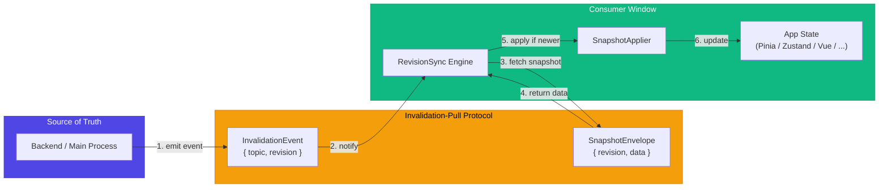
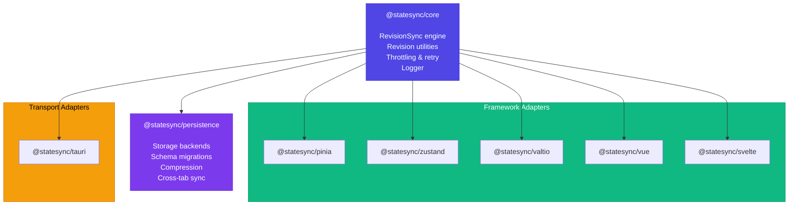
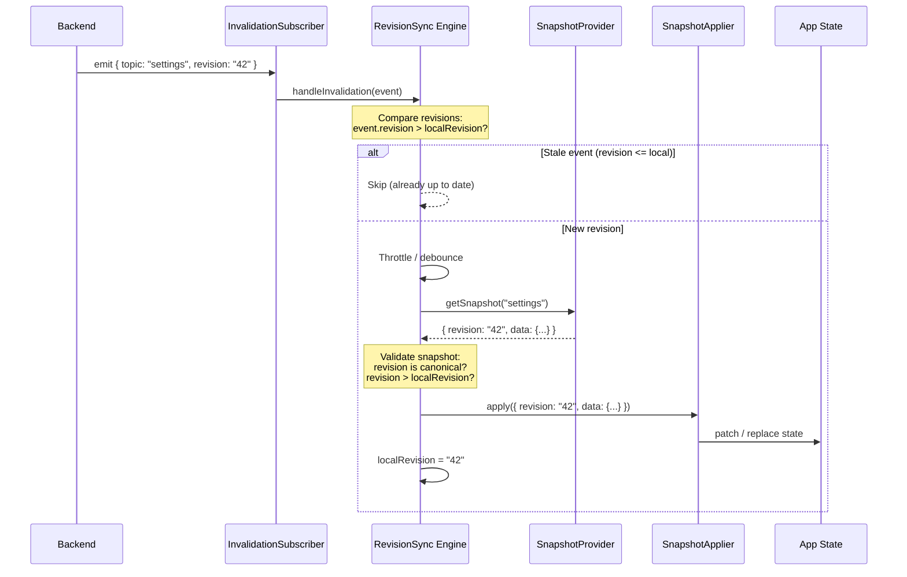
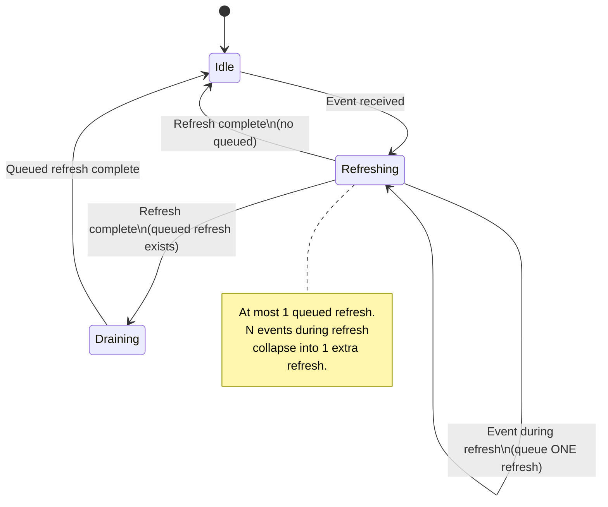
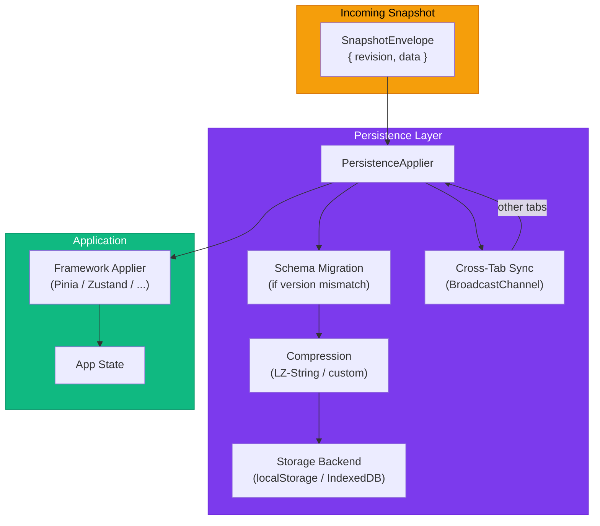
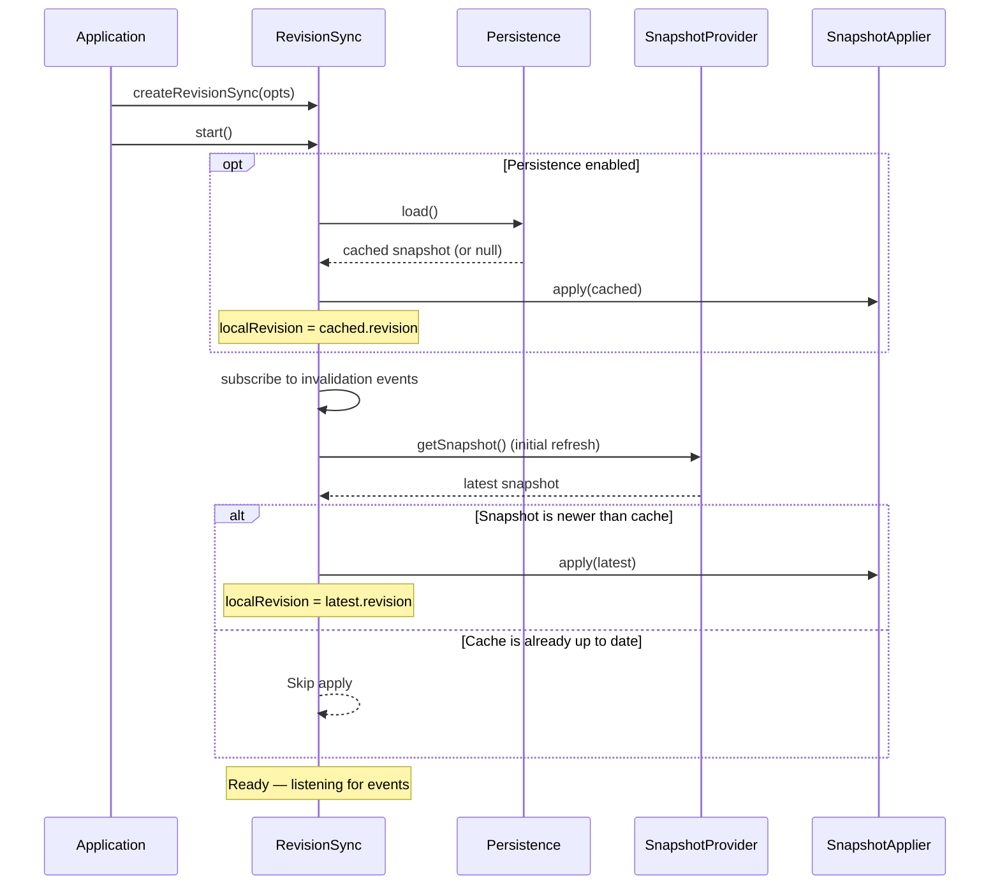
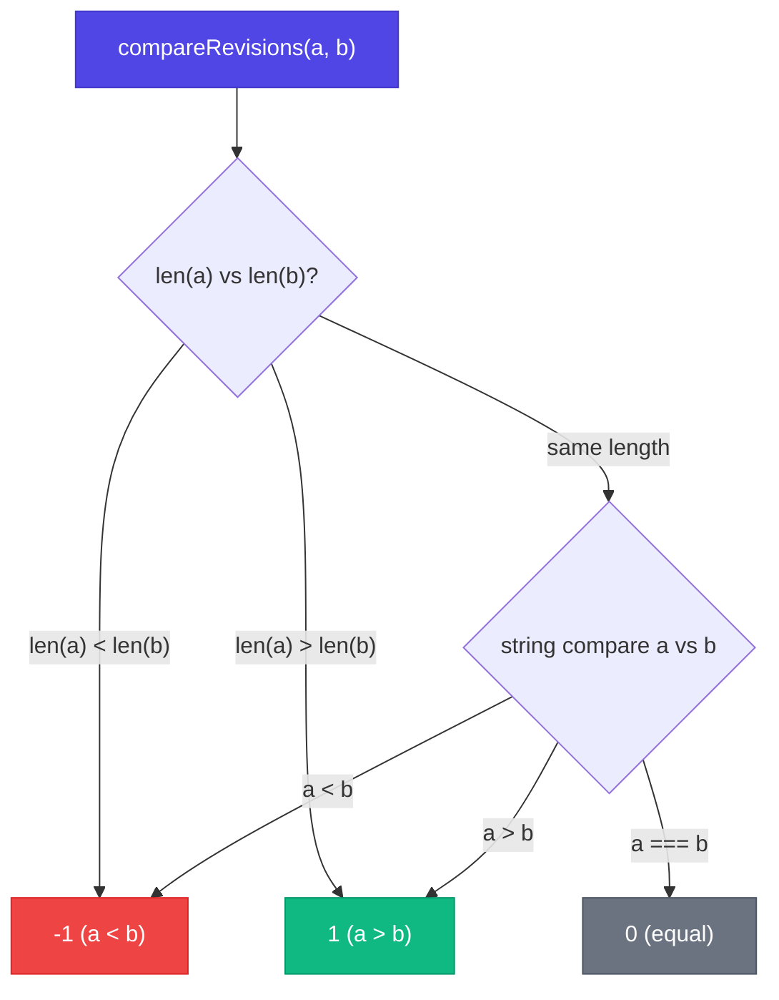
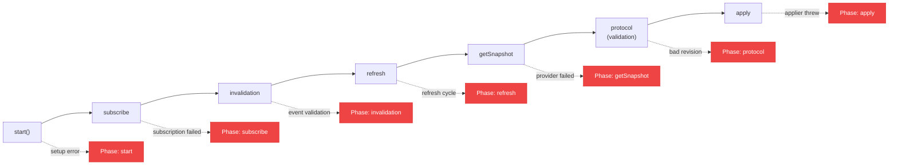

# Architecture

How state-sync keeps your app state consistent across windows, tabs, and processes.

## High-level overview

The library implements an **invalidation-pull** protocol: a lightweight event signals that something changed, and the receiver pulls the latest snapshot on demand.

## Package structure

All framework and transport adapters depend only on `@statesync/core`. The persistence layer is optional.

## Core protocol

The sync engine follows a strict sequence to guarantee consistency:

## Coalescing strategy

When multiple invalidation events arrive in rapid succession, the engine coalesces them to prevent refresh spam:

This means even 100 events firing in a burst result in at most **2 refreshes** — not 100.

## Data flow with persistence

When the persistence layer is enabled, it wraps the applier to add storage, compression, and cross-tab broadcast:

## Startup sequence

## Revision comparison

Revisions are canonical `u64` decimal strings (`"0"`, `"42"`, `"1843674407370955161"`). Comparison is simple and fast:

No cryptographic hashing. No timestamps. Just monotonic integers — simple and reliable.

## Error handling phases

The engine reports errors with structured context, including which phase of the sync cycle failed:

Each error includes `phase`, `topic`, `localRevision`, `error`, and optional `eventRevision` / `snapshotRevision` — making debugging straightforward.

## Design principles

| Principle | How it's applied |
|-----------|-----------------|
| **Transport-agnostic** | Core knows nothing about Tauri, WebSocket, or BroadcastChannel. You provide a subscriber + provider. |
| **Framework-agnostic** | Core knows nothing about Pinia, Zustand, or Vue. You provide an applier function. |
| **Source of truth** | One canonical backend. All windows pull from the same provider. No circular sync. |
| **Revision ordering** | Monotonic `u64` revisions. Stale events are rejected without network calls. |
| **Coalescing** | Rapid bursts collapse into at most 2 refreshes. No thundering herd. |
| **Graceful degradation** | Missing BroadcastChannel? No-op. Failed apply? Continue syncing. Every error is reported, nothing crashes. |
| **Tiny footprint** | Core is 3.1 KB gzipped. Each adapter is ~0.8 KB. |
