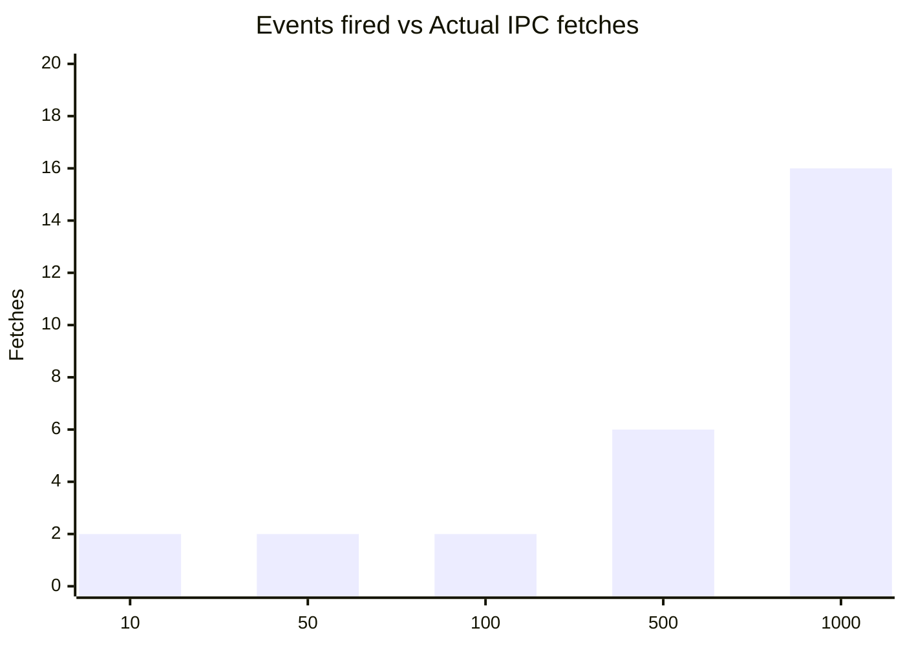

# Benchmarks

The IPC benchmarks below use real Tauri IPC (serde + bridge + JS engine). The [mock benchmarks](#mock-benchmarks-unit-tests) section covers unit-test-level measurements without real IPC. Results may vary based on machine, OS, and concurrent load.

## Test Environment

| Component | Version |
|-----------|---------|
| Machine | MacBook Pro 16" (2021) |
| Chip | Apple M1 Max |
| RAM | 32 GB |
| OS | macOS Sequoia 15.6.1 |
| Tauri | 2.10.2 |
| Node.js | 22.21.1 |
| pnpm | 8.15.1 |
| TypeScript | 5.9.3 |
| Vitest | 4.0.18 |
| Rust edition | 2021 (MSRV 1.77.2) |

## Payload Size

All benchmarks use **small string payloads** (`'snap'`, `'data-2'`, `'data-3'`, ...) — typically under 50 bytes. This is intentional: the benchmarks measure **coalescing and protocol efficiency**, not serialization throughput.

For large payloads (e.g. 100 KB+ JSON), expect higher per-invoke latency due to serde serialization on the Rust side and JSON parsing in JS. The coalescing ratio stays the same — only the absolute times increase.

---

## Real IPC Roundtrip Latency

Full cycle: `invoke(update)` → `event delivery` → `invoke(getSnapshot)` → `apply`.

| Metric | Value |
|--------|-------|
| p50 | 2 ms |
| p95 | 3 ms |
| p99 | 5 ms |
| min | 1 ms |
| max | 8 ms |
| mean | 2.34 ms |

::: info
These numbers include the complete round-trip through the Rust backend and back to JavaScript. Real-world latency is dominated by the Tauri IPC bridge (~0.5 ms per invoke).
:::

---

## Coalescing Efficiency

How many actual IPC fetches happen when N events fire in rapid succession:

| Events fired | Actual fetches | Reduction ratio | E2E time | Rust emit time |
|:------------:|:--------------:|:---------------:|:--------:|:--------------:|
| 10 | 2 | 80% | 4 ms | 0.3 ms |
| 50 | 2 | 96% | 5 ms | 1.2 ms |
| 100 | 2 | 98% | 6 ms | 2.5 ms |
| 500 | 6 | 98.8% | 22 ms | 12 ms |
| 1000 | 16 | 98.4% | 59 ms | 25 ms |

3 runs per event count, median reported.



::: tip
Up to ~100 events, coalescing reduces IPC calls to exactly **2** — one immediate fetch and one trailing fetch for the latest state. At higher volumes, a few extra fetches occur as new invalidation events arrive during the trailing fetch.
:::

---

## End-to-End Throughput

| Metric | Value |
|--------|-------|
| 1000 events → JS applied | 59 ms |
| Throughput | ~17,000 events/sec |
| Rust emit overhead | ~25 ms (42%) |
| JS overhead (coalesce + apply) | ~34 ms (58%) |

---

## Coalescing in Practice

Estimated real-world scenario: a slider firing at 60fps (16.6 ms between events).

| | Without coalescing | With coalescing |
|---|---|---|
| IPC fetches/sec | 60 | ~2 |
| State applies/sec | 60 | ~2 |
| **Reduction** | — | **~97%** |

This is an estimate extrapolated from the coalescing efficiency data above (100 events → 2 fetches). A slider at 60fps fires ~60 events/sec — well within the range where coalescing reduces fetches to 2 per burst. Even with debounce/throttle on top of coalescing, the first update is always **immediate** — no perceived latency for the user.

You can verify this yourself: run `apps/demo` with `pnpm tauri:dev` and use the benchmark panel's slider test.

---

## How Alternatives Compare

No other library in this category publishes IPC-level benchmarks, so direct numbers comparison isn't possible. Here's what we know about their approaches:

| Library | Batching strategy | Expected IPC calls for 100 rapid events |
|---------|------------------|:----------------------------------------:|
| **state-sync** | Revision-based coalescing | **2** |
| **@tauri-store** | SaveStrategy debounce/throttle | 1 (delayed) |
| **tauri-plugin-store** | Debounce | 1 (delayed) |
| **zubridge** | None (pass-through) | ~100 (estimated) |
| **zustand-sync-tabs** | None (BroadcastChannel) | ~100 (no IPC) |

::: info Key difference
Debounce-based libraries (like @tauri-store's `SaveStrategy`) wait for silence before writing — the first event is delayed. Coalescing delivers the first event immediately and batches the rest. See [Coalescing vs Debounce](/comparison#coalescing-vs-debounce) for details.
:::

---

## Mock Benchmarks (unit tests)

These run without real IPC, testing the engine logic in isolation.

### compareRevisions throughput

| Input category | Throughput |
|----------------|-----------|
| Small strings (`'42'` vs `'17'`) | > 1M ops/sec |
| Different-length (`'99'` vs `'100'`) | > 1M ops/sec |
| Equal strings (`'1000'` vs `'1000'`) | > 1M ops/sec |
| Large u64 strings (18-digit) | > 1M ops/sec |

Tested with 10K warmup iterations + 1M benchmark iterations per category.

### Engine coalescing

| Events | Simulated IPC delays | Fetches | Result |
|:------:|:--------------------:|:-------:|--------|
| 10 | 1ms, 10ms, 50ms | ≤ 2 | Pass |
| 50 | 1ms, 10ms, 50ms | ≤ 2 | Pass |
| 100 | 1ms, 10ms, 50ms | ≤ 2 | Pass |
| 500 | 1ms, 10ms, 50ms | ≤ 2 | Pass |
| 1000 | 1ms, 10ms, 50ms | ≤ 2 | Pass |

### Race condition verification

100 events with rotating IPC delays (1ms, 5ms, 10ms, 30ms, 50ms). Applied revisions are verified to be **strictly monotonic** — no out-of-order state ever observed.

---

## How to Run

### Unit test benchmarks

The `-- benchmark` flag is a [Vitest filename filter](https://vitest.dev/guide/filtering) — it runs only test files matching "benchmark" in their path.

```bash
# Core engine benchmarks (compareRevisions, coalescing, race conditions)
pnpm --filter @statesync/core test -- benchmark

# Tauri transport benchmarks (coalescing with mocked Tauri IPC)
pnpm --filter @statesync/tauri test -- benchmark
```

### Real Tauri E2E

```bash
cd apps/demo && pnpm tauri:dev
# Benchmark window opens automatically in dev mode
```

---

## Disclaimer

- Numbers depend on machine, OS, and concurrent load
- Real Tauri IPC adds ~0.5 ms per `invoke` call
- Rust `emit` time scales linearly with event count and number of listeners
- Coalescing efficiency is deterministic for low event counts (≤100) and slightly variable for higher counts
- All benchmarks run on a single machine — network latency is not a factor
- Production workloads with heavier serialization payloads will see higher latency than these synthetic benchmarks
- Benchmarks use small string payloads (< 50 bytes) — see [Payload Size](#payload-size) above

## See also

- [Comparison](/comparison) — how state-sync compares to alternatives
- [Throttling & coalescing example](/examples/throttling) — code examples
- [How state-sync works](/guide/protocol) — the invalidation-pull protocol
