# state-sync vs Alternatives

Honest comparison for multi-window state synchronization. If a simpler tool fits your use case — use it. We'll tell you which one.

## The Problem

When multiple windows share state, updates can arrive out of order:

```
Window A: set(1) ──────────────────► arrives second
Window B: set(2) ──► arrives first
Result: state = 1 (wrong, should be 2)
```

Many simple sync libraries don't address this. state-sync solves it with revision-based ordering.

---

## Coalescing vs Debounce

These are different things. Debounce **delays** the first response. Coalescing delivers the first event **immediately** and batches the rest.

```
Debounce (waits for silence):
  events:  ×  ×  ×  ×  ×  ·  ·  ·  ·  →  fetch
  time:    0  1  2  3  4  5  6  7  8     (ms)
           ↑                              ↑
           first event                    response (delayed 4+ ms)

Coalescing (at most 2 IPC calls):
  events:  ×  ×  ×  ×  ×
  time:    0  1  2  3  4  (ms)
           ↑           ↑
           fetch₁      fetch₂ (latest state)
           immediate   immediate
```

| | Debounce | Throttle | Coalescing |
|---|---|---|---|
| First event | Delayed | Immediate | Immediate |
| During burst | Waits for silence | Fires at interval | At most 2 IPC calls |
| IPC calls for 100 events | 1 (delayed) | ~N/interval | 2 |
| Stale data risk | Low (but delayed) | Medium | Very low (revision-checked) |

::: info
state-sync supports debounce and throttle **on top of** coalescing. You can combine them — coalescing handles the IPC layer, while debounce/throttle controls how often your UI re-renders.
:::

---

## How state-sync Works

```
Backend: state changed → emit("invalidated")
    ↓
All windows: receive event
    ↓
Each window: fetch snapshot → revision > local? → apply (else skip)
```

Stale updates are automatically rejected. Rapid events are coalesced into at most 2 fetches per burst, regardless of event count during that burst.

---

## Feature Matrix

| Feature | state-sync | @tauri-store | tauri-plugin-store | zubridge | zustand-sync-tabs | pinia-shared-state |
|---------|:----------:|:------------:|:-----------------:|:--------:|:-----------------:|:------------------:|
| Revision ordering | ✅ | ❌ | ❌ | ❌ | ⚠️ Latest wins | ❌ |
| Coalescing | ✅ | ❌ | ❌ | ❌ | ❌ | ❌ |
| Debounce/Throttle | ✅ | ✅ SaveStrategy | ✅ Debounce | ❌ | ❌ | ❌ |
| Retry | ✅ Exponential | ❌ | ❌ | ❌ | ❌ | ❌ |
| Persistence | ✅ Separate pkg | ✅ Built-in | ✅ File | ❌ | ✅ localStorage | ❌ |
| Framework | Any | Zustand / Pinia / Valtio | Any | Any | Zustand only | Pinia only |
| Tauri IPC | ✅ | ✅ | ✅ | ✅ | ❌ | ❌ |
| Electron IPC | ✅ | ❌ | ❌ | ✅ | ❌ | ❌ |
| Browser (BroadcastChannel) | ❌ | ❌ | ❌ | ❌ | ✅ | ✅ |
| Actively maintained | ✅ | ✅ | ✅ | ✅ | ✅ | ⚠️ Last commit Feb 2025 |

::: tip Webview-only libraries in Tauri
zustand-sync-tabs and pinia-shared-state use `BroadcastChannel` to sync between Tauri webviews. This works, but it does **not** go through the Rust–JS IPC bridge — meaning the Rust backend has no visibility into state changes.
:::

---

## Tauri Ecosystem

### @tauri-store/zustand + @tauri-store/pinia

The main alternative for Tauri apps. Clean DX with built-in disk persistence.

```ts
import { create } from 'zustand';
import { createTauriStore } from '@tauri-store/zustand';

const useCounterStore = create((set) => ({
  counter: 0,
  increment: () => set((s) => ({ counter: s.counter + 1 })),
}));

const tauriStore = createTauriStore('counter', useCounterStore);
await tauriStore.start();
```

**Good:** Clean DX, disk persistence built-in, `SaveStrategy` with debounce/throttle, actively maintained, great for simple cases.

**Limitations:** No revision ordering (debounce ≠ coalescing — see [above](#coalescing-vs-debounce)), Zustand/Pinia/Valtio only, Tauri 2.x only.

**Use @tauri-store when:** Simple Tauri app with Zustand or Pinia, ordering doesn't matter, want persistence with minimal setup.

**Use state-sync instead when:** Ordering matters, you need coalescing for rapid updates, want retry on failure, or need framework flexibility beyond Zustand/Pinia.

---

### tauri-plugin-store

Official Tauri key-value storage. Built for preferences, not complex state.

```ts
const store = await Store.load('settings.json')
await store.set('theme', 'dark')
```

**Good:** Official, file persistence, debounce, multi-window sync.

**Limitations:** No ordering guarantees, no migration system, no compression. Designed for preferences, not complex state synchronization.

**Use when:** Simple app settings — theme, language, window positions.

---

### zubridge (Tauri mode)

Redux-like actions over Tauri IPC. Also works with Electron (see below).

```ts
import { initializeBridge } from '@zubridge/tauri';
import { invoke } from '@tauri-apps/api/core';
import { listen } from '@tauri-apps/api/event';

initializeBridge({ invoke, listen });

// In components:
import { useZubridgeStore, useZubridgeDispatch } from '@zubridge/tauri';

const count = useZubridgeStore((state) => state.count);
const dispatch = useZubridgeDispatch();
dispatch({ type: 'increment' });
```

**Good:** Familiar Redux pattern, works with any framework, cross-platform (Tauri + Electron).

**Limitations:** No ordering, no coalescing, no retry, no persistence.

**Use when:** Your team knows Redux and ordering doesn't matter.

::: details How does state-sync compare in code?
```ts
import { SyncEngine } from '@statesync/core';
import { tauriTransport } from '@statesync/tauri';

const engine = new SyncEngine({
  transport: tauriTransport({ key: 'my-store' }),
  onSnapshot: (snapshot) => store.setState(snapshot),
});

engine.start();
```
state-sync doesn't wrap your store — it subscribes to invalidation events and applies snapshots with revision checking.
:::

---

### Browser-based libraries in Tauri

**zustand-sync-tabs** and **pinia-shared-state** work in Tauri webviews via `BroadcastChannel`. They sync between webviews, but **not** through Rust IPC — the Rust backend never sees these state changes.

```ts
// zustand-sync-tabs
import { syncTabs } from 'zustand-sync-tabs';

create(syncTabs((set) => ({ ... }), { name: 'my-channel' }))

// pinia-shared-state
pinia.use(PiniaSharedState({ enable: true }))
```

**Good:** Tiny (~1 KB each), zero config, simple API.

**Limitations:** No ordering, no error handling, browser-only transport, Rust backend is unaware of state.

**Use when:** Lightweight UI sync between Tauri webviews where backend awareness isn't needed.

---

### Technical Architecture Ranking

Engineering-only comparison: protocol design, correctness guarantees, IPC efficiency, security model. Does not factor in adoption, community size, or maintenance activity.

| # | Library | Score | Key technical advantage |
|---|---------|:-----:|------------------------|
| 1 | **state-sync** | **9.0** | Revision ordering + coalescing O(2) + pluggable transport + 8 error phases |
| 2 | **@tauri-store/\*** | **7.0** | Bidirectional Rust↔JS + configurable SaveStrategy (debounce/throttle) + key filtering |
| 3 | **zubridge** | **6.0** | Cross-platform Tauri+Electron + Redux dispatch pattern + StateManager trait |
| 4 | **tauri-plugin-store** | **5.5** | Official Tauri plugin + custom serialization + per-key change events |
| 5 | **Browser-based (zustand-sync-tabs / pinia-shared-state)** | **4.5** | Zero config, ~1 KB, no Rust dependency, standards-backed API |

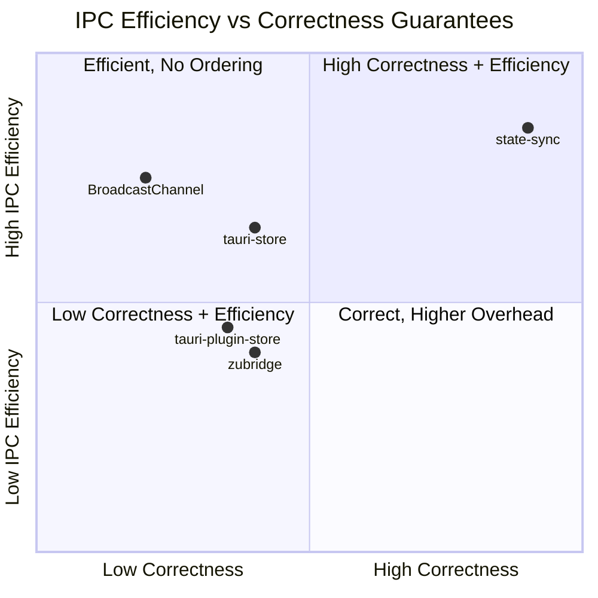

::: details Scoring breakdown (8 criteria, weighted)

Criteria weighted by engineering importance for a state sync library:
- **High weight (×2):** consistency model, IPC efficiency, security architecture
- **Medium weight (×1.5):** error resilience, modularity
- **Standard weight (×1):** type system, cross-platform, bundle efficiency

| Criteria | state-sync | @tauri-store | zubridge | plugin-store | Browser-based |
|----------|:----------:|:------------:|:--------:|:------------:|:-------------:|
| Consistency model | 10 | 5 | 4 | 4 | 2 |
| IPC efficiency | 9.5 | 7 | 4 | 5 | **10** |
| Security architecture | 10 | 8 | 8 | 8 | 3 |
| Error resilience | 10 | 6 | 5 | 5 | 1 |
| Modularity | 10 | 8 | 6 | 5 | 3 |
| Type system | 9 | 8 | 7 | 6 | 5 |
| Cross-platform | 8 | 3 | **10** | 3 | 7 |
| Bundle efficiency | 8 | 6 | 7 | 8 | **10** |

**Why browser-based tools score low despite having the best IPC efficiency:** BroadcastChannel bypasses Rust IPC entirely (zero overhead), but provides no ordering, no error handling, and the Rust backend remains unaware of state changes. In Tauri apps the backend is often the source of truth, making this a fundamental limitation.

**Why @tauri-store scores higher than tauri-plugin-store:** both use similar Rust-backed KV patterns, but @tauri-store adds configurable SaveStrategy (debounce/throttle for disk persistence), key filtering via `filterKeys`, a JS-side `syncStrategy` option, and framework adapters for Zustand, Pinia, Valtio, Svelte, and Vue. tauri-plugin-store has the advantage of being the official Tauri plugin with guaranteed long-term maintenance and first-class Tauri integration.

state-sync is the author of this page. Verify claims using the raw data in the [Feature Matrix](#feature-matrix) above.
:::

---

### Architecture Overview

How each library moves state between Tauri's Rust backend and webview frontends. Grouped by architectural pattern rather than per-library.

#### Pattern 1 — Invalidation-pull (state-sync)

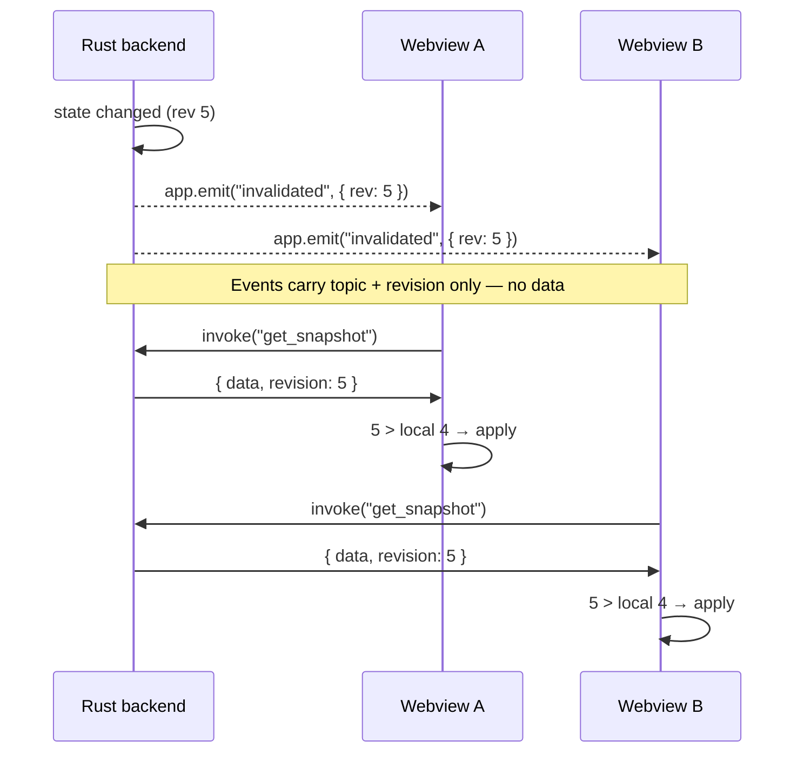

Events are lightweight (topic + revision number, no payload). Webview **pulls** a verified snapshot only when needed. Stale events are safe (revision comparison rejects them). Burst of 100 rapid changes → 2 IPC calls thanks to coalescing (`refreshInFlight` / `refreshQueued` flags).

#### Pattern 2 — Bidirectional KV sync (tauri-store, tauri-plugin-store)

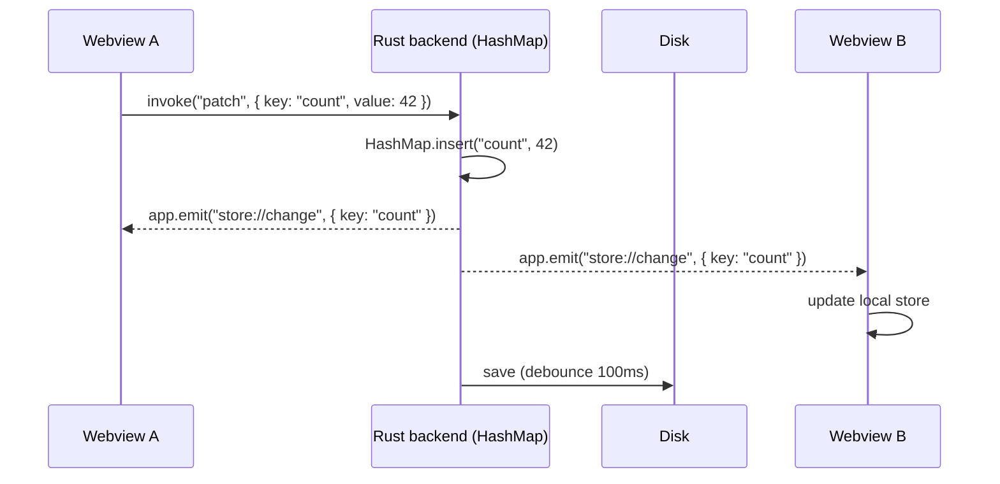

Source of truth is the Rust `HashMap` behind a `Mutex`. Every `set()` in JS triggers an `invoke()` to Rust, which updates the map and broadcasts a change event to all webviews. Disk persistence is debounced (tauri-plugin-store: 100ms default, @tauri-store: configurable debounce/throttle via tokio channels). No revision ordering — last write wins.

#### Pattern 3 — Hub-and-spoke dispatch (zubridge) + peer-to-peer (BroadcastChannel)

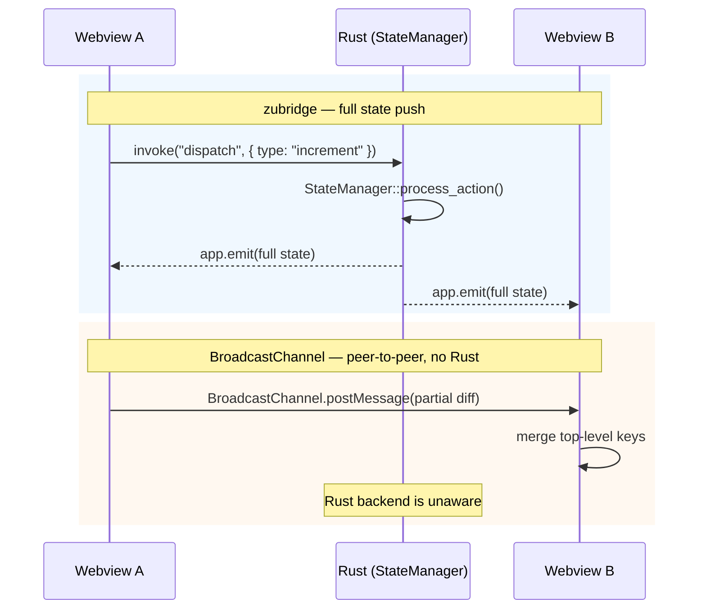

zubridge uses a Redux-style dispatch → process → push cycle through Rust. The `StateManager` trait processes actions in a `Mutex`, then emits **full state** to all windows (no delta, no ordering). BroadcastChannel tools (`zustand-sync-tabs`, `pinia-shared-state`) bypass Rust entirely — fast (~0 overhead) but the backend remains unaware of state changes.

---

## Electron Ecosystem {#electron-ecosystem}

### Electron Feature Matrix

| Feature | state-sync | @zubridge/electron | reduxtron | electron-shared-state | electron-redux |
|---------|:----------:|:------------------:|:---------:|:--------------------:|:--------------:|
| **Architecture** | Invalidation-pull | Hub-and-spoke | Centralized store | Distributed copies | Dual store sync |
| **Source of truth** | Main process | Main process | Main process | Every process | Main process |
| **Multi-window** | ✅ | ✅ Auto-tracked | ⚠️ Manual wiring | ✅ Auto | ✅ Broadcast all |
| **Framework** | Any | Zustand / Redux / Custom | Redux | Agnostic | Redux only |
| **State lib adapters** | Redux, Zustand, Jotai, MobX, Pinia, Vue, Valtio, Svelte | Zustand, Redux | Redux, Zustand adapter | None | Redux |
| **Delta sync** | ❌ Full snapshot | ❌ Full state | ❌ Full state | ✅ Immer patches | ❌ Full actions |
| **Sync mechanism** | Pull (invalidation events) | Push (full state) | Push (full state) | Push (Immer patches) | Push (action replay) |
| **Selective sync** | Per-topic | Per-key subscriptions | ❌ Full state | ❌ Full patches | ❌ All actions |
| **Revision ordering** | ✅ | ❌ | ⚠️ Sequential in main | ❌ | ❌ |
| **Coalescing** | ✅ 2 IPC per burst | ❌ | ❌ | ❌ | ❌ |
| **Debounce / Throttle** | ✅ Configurable | ❌ | ❌ | ❌ | ❌ |
| **Retry** | ✅ Exponential backoff | ❌ | ❌ | ❌ | ❌ |
| **Compression** | ✅ LZ / custom | ❌ | ❌ | ❌ | ❌ |
| **Structured errors** | ✅ Phase-based | ✅ 7 error types | ❌ | ❌ | ❌ |
| **Redux DevTools** | ❌ | ❌ | ✅ | ❌ | ✅ |
| **Thunks / async** | N/A (protocol-level) | ✅ Priority-based | ❌ Serializable only | N/A | ❌ |
| **Persistence** | ✅ Separate pkg | ❌ | ❌ Demo only | ❌ | ❌ |
| **Data migrations** | ✅ Versioned | ❌ | ❌ | ❌ | ❌ |
| **TypeScript** | ✅ | ✅ | ✅ | ✅ | ✅ |
| **contextIsolation** | ✅ | ✅ (also supports `false`) | ✅ | ❌ Requires `false` | ⚠️ v2 only |
| **sandbox: true** | ✅ | ⚠️ v2.2 (prerelease) | ✅ | ❌ | ❌ |
| **nodeIntegration** | Not needed | Not needed | Not needed | **Required** | Required (v1) |
| **BrowserView / WebContentsView** | N/A | ✅ Both supported | N/A | N/A | N/A |
| **API simplicity** | Moderate (engine setup) | Moderate (bridge setup) | Moderate (preload wiring) | ✅ Single function | Moderate (enhancer) |
| **Bundle size** | ~3 KB core + <1 KB transport | ~8 KB | ~1.2 KB (zero deps) | ~1.4 KB + immer (~16 KB) | ~5 KB |
| **GitHub stars** | — | 44 | 37 | 60 | 758 |
| **npm weekly downloads** | — | ~730 | ~35 | ~45 | ~2,500 |
| **Actively maintained** | ✅ | ✅ | ⚠️ Last commit Apr 2024 | ❌ Last commit Apr 2023 | ❌ Dead since 2020 |
| **Electron requirement** | Any | ≥12 | ≥24 | Any (legacy model) | ≥8 (v1 broken on 14+) |

::: info Reading the table
- ✅ = fully supported, ❌ = not supported, ⚠️ = partial or conditional support
- Bundle sizes for state-sync and @zubridge/electron are minified + gzipped via [bundlejs.com](https://bundlejs.com). Sizes for reduxtron, electron-shared-state, and electron-redux are estimates based on source analysis (these packages import from `electron` and cannot be measured on bundlejs.com). state-sync = `@statesync/core` + `@statesync/electron`
- state-sync is a new library with no established adoption metrics yet
- electron-redux has high star count due to historical popularity (pre-2021)
:::

---

### Technical Architecture Ranking

Engineering-only comparison: protocol design, correctness guarantees, IPC efficiency, security model. Does not factor in adoption, community size, or maintenance activity.

| # | Library | Score | Key technical advantage |
|---|---------|:-----:|------------------------|
| 1 | **state-sync** | **9.5** | Revision ordering + coalescing O(2) + pluggable transport |
| 2 | **@zubridge/electron** | **7.0** | Reliable hub-and-spoke + 7 structured error types + middleware |
| 3 | **reduxtron** | **6.0** | Cleanest security model + zero runtime dependencies (~1.2 KB) |
| 4 | **electron-shared-state** | **5.0** | Delta sync via Immer patches — only library with true differential updates |
| 5 | **electron-redux** | **4.5** | Composable StoreEnhancer pattern (good concept, incomplete execution) |

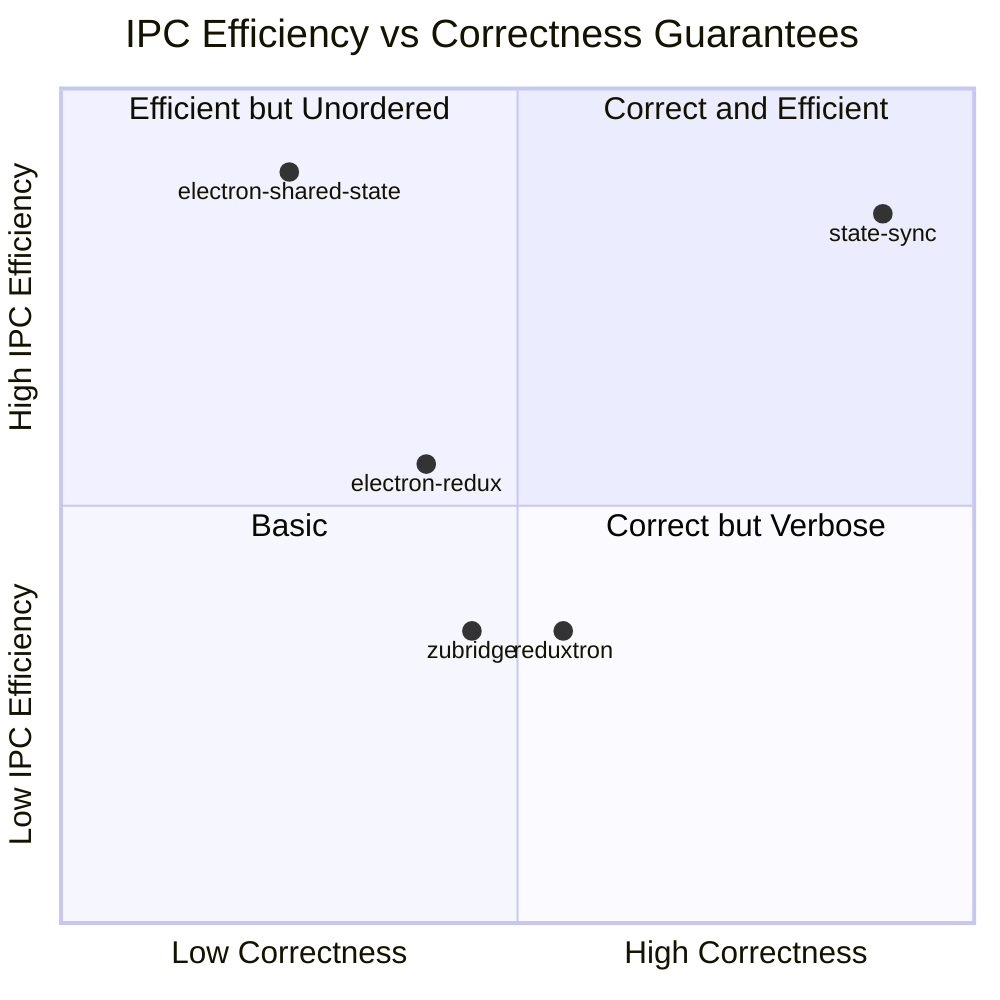

::: details Scoring breakdown (8 criteria, weighted)

Criteria weighted by engineering importance for a state sync library:
- **High weight (×2):** consistency model, IPC efficiency, security architecture
- **Medium weight (×1.5):** error resilience, modularity
- **Standard weight (×1):** type system, cross-platform, bundle efficiency

| Criteria | state-sync | zubridge | reduxtron | shared-state | electron-redux |
|----------|:----------:|:--------:|:---------:|:------------:|:--------------:|
| Consistency model | 10 | 5 | 6 | 5 | 5 |
| IPC efficiency | 9.5 | 5 | 5 | **10** | 5 |
| Security architecture | 10 | 8.5 | **10** | 2 | 3 |
| Error resilience | 10 | 7 | 2 | 3 | 2 |
| Modularity | 10 | 7 | 5 | 4 | 6 |
| Type system | 9 | 8 | 7 | 7 | 5 |
| Cross-platform | 10 | 7 | 2 | 2 | 2 |
| Bundle efficiency | 9 | 7 | **10** | 5 | 7 |

**Why electron-shared-state scores low despite having the best IPC efficiency:** its Immer patch mechanism is technically brilliant (the only delta sync in the ecosystem), but requiring `nodeIntegration: true` is a fundamental architectural limitation — not a missing feature, but a design constraint that makes it incompatible with modern Electron's process isolation. Security architecture carries high weight because it reflects core protocol design decisions.

state-sync is the author of this page. Verify claims using the raw data in the [Feature Matrix](#electron-feature-matrix) above.
:::

---

### Architecture Overview

How each library moves state between Electron's main and renderer processes.

#### state-sync — Invalidation-pull

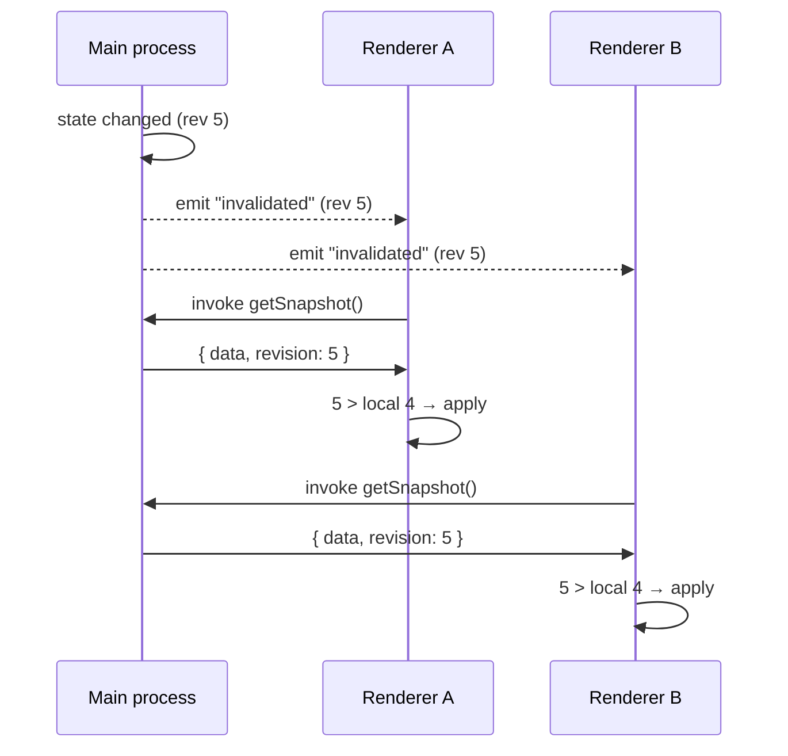

Renderer never receives state directly — it **pulls** a verified snapshot. Stale events are safe (revision check). Burst of 100 events → 2 IPC calls (coalescing).

#### @zubridge/electron — Hub-and-spoke push

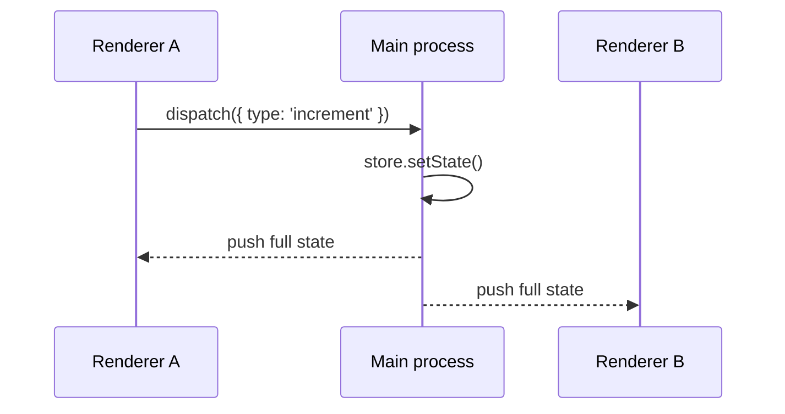

Main pushes the **entire state** to all tracked windows on every change. Simple and reliable, but no ordering guarantees and O(N) IPC calls per update.

#### reduxtron — Centralized Redux via preload

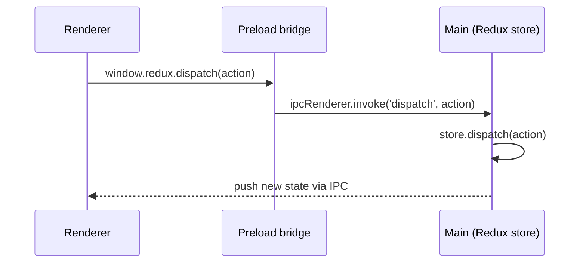

Store exists **only** in main. Renderer dispatches through a preload bridge. `getState()` requires an IPC round-trip (async).

#### electron-shared-state — Distributed Immer patches

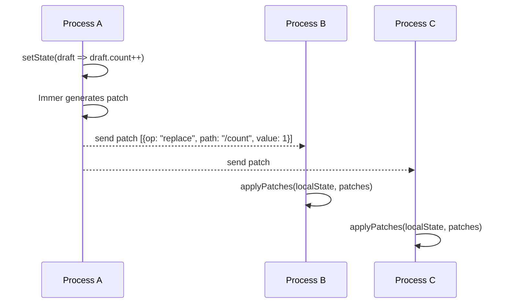

Each process holds its own copy. Only the **delta** (Immer patch) is sent — most bandwidth-efficient. Requires `nodeIntegration: true`.

#### electron-redux — Dual store action replay

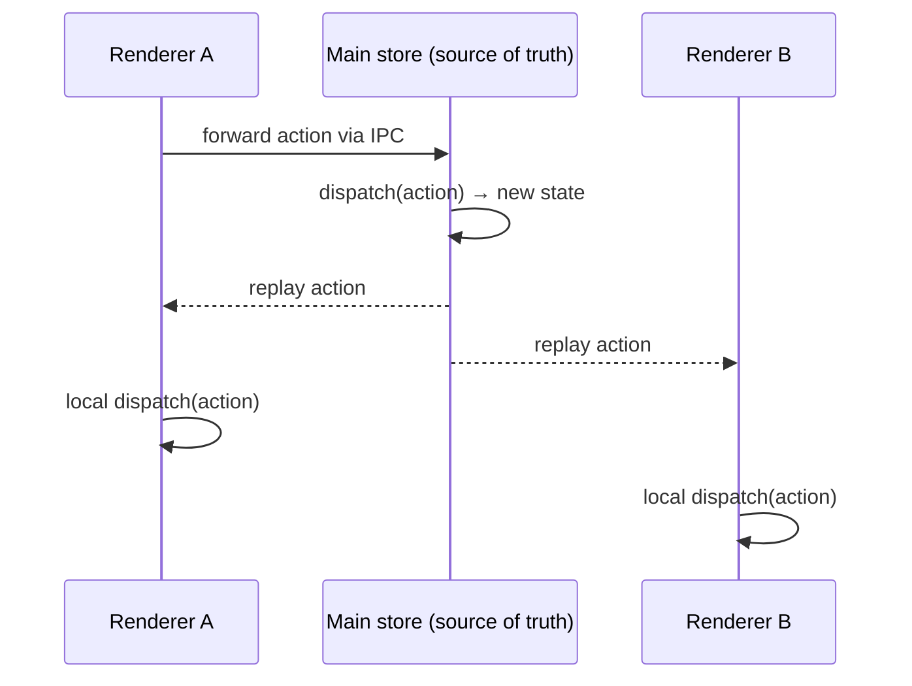

Actions are forwarded to main and replayed in all renderers. Each process maintains its own Redux store. v1 depends on deprecated `electron.remote`.

---

### @zubridge/electron

Active successor to [Zutron](https://github.com/goosewobbler/zutron). Main process acts as the single source of truth, TypeScript-first. The most actively maintained Electron state sync alternative.

```ts
// Main process
import { createZustandBridge } from '@zubridge/electron/main';

const bridge = createZustandBridge(store);
const { unsubscribe } = bridge.subscribe([mainWindow]);
```

**Good:** Active development, TypeScript, main process as source of truth, works with Zustand and Redux, follows modern Electron security model (`contextIsolation`; `sandbox` support coming in v2.2), structured error system (7 typed error classes), thunk support with action scheduling, selective per-key subscriptions, automatic window tracking and cleanup, supports `BrowserView` and `WebContentsView` (not just `BrowserWindow`), IPC traffic logging via middleware system (v2.0+), also supports legacy `contextIsolation: false` (v2.1+).

**Limitations:** No revision ordering (last-write-wins), no coalescing, no retry on failure, no built-in persistence or data migrations, no delta sync or compression, sends full state on every update.

**Use when:** Electron app with Zustand or Redux, you want proper security model with active maintenance, and ordering doesn't matter.

---

### reduxtron

Minimal Redux bridge for Electron. Store lives exclusively in main process, renderers communicate via preload bridge. Follows modern security practices.

```ts
// Preload
import { preloadReduxBridge } from 'reduxtron/preload';
contextBridge.exposeInMainWorld('redux', preloadReduxBridge(ipcRenderer));
```

**Good:** Tiny (~1.2 KB), modern security model (`contextIsolation`, `sandbox`), zero runtime dependencies, framework-agnostic with React/Svelte/Vue/Vanilla boilerplates, Zustand adapter included, supports Redux DevTools, tray menu integration demonstrated in demo app.

**Limitations:** Manual per-window wiring required (`ipcMain.emit` pattern requires extra code to forward state to renderers), sends full state on every change, no thunks/async actions from renderer (serializable only), `getState()` is async in renderer, no ordering/coalescing/retry, last commit April 2024.

**Use when:** Minimal Electron + Redux setup, want proper security with zero overhead and tiny bundle.

---

### electron-redux

StoreEnhancer pattern by Klarna. Once the most popular Electron state sync library (~758 stars).

**Good:** Well-designed API concept, Redux ecosystem integration, TypeScript (v2).

**Not recommended:** v1 depends on deprecated `electron.remote` — **broken with Electron 14+** (removed in 2021). v2 was in alpha for years (`v2.0.0-alpha.9`, June 2021) before being published as `v2.0.0` on npm in October 2024, though the October release primarily updated CI/docs rather than library code. Documentation is incomplete for v2. 29 open issues with no maintainer response since 2021.

---

### electron-shared-state

Immer-based shared state. Each process holds its own state copy; changes are synced via Immer patches (delta-only, efficient for large states).

```ts
import { createSharedStore } from 'electron-shared-state';

const sharedStore = createSharedStore({ count: 0 });
sharedStore.setState((state) => { state.count++; });
```

**Good:** Elegant single-function API, Immer patch-based sync (only changed data sent over IPC — the only Electron library with true delta sync), TypeScript, automatic multi-window support, zero config, named stores support for multiple independent stores, framework-agnostic.

**Limitations:** Requires `nodeIntegration: true` and `contextIsolation: false` — incompatible with modern Electron security model. Compatibility issues with some modern bundlers ([issue #11](https://github.com/zoubingwu/electron-shared-state/issues/11)). No initial state sync for late-connecting renderers. Last commit April 2023.

**Use when:** Internal/trusted-content Electron app where delta sync matters (large state objects), you control all loaded content, and simplicity is the priority. Not suitable for apps loading remote/untrusted content.

---

::: warning Not recommended for new projects
- **electron-state-ipc** — abandoned, ~5 downloads/month
- **vuex-electron** — abandoned 2019, Vuex 3 only (~1,600 downloads/month from legacy projects)
- **redux-electron-store** — abandoned 2019, requires `nodeIntegration: true`
- **electron-store** — persistence/config tool, **not** state sync (commonly confused). Great for saving settings to disk, but [file-watching sync is unreliable](https://github.com/sindresorhus/electron-store/issues/165) across processes.
:::

---

## When to Use state-sync

- **Ordering matters** — config, auth, anything where stale writes corrupt state
- **Rapid updates** — coalescing prevents IPC flood (100 events → 2 fetches)
- **Need retry** — exponential backoff on IPC failures
- **Want structure** — phase-based errors, not just try/catch
- **Multiple frameworks** — Redux, Zustand, Jotai, MobX, Pinia, Vue, Valtio, Svelte adapters
- **Cross-platform** — same core for Tauri and Electron
- **Persistence with migrations** — versioned state upgrades via `@statesync/persistence`

---

## When NOT to Use state-sync

| Use case | Better choice |
|----------|--------------|
| Simple Tauri + Zustand/Pinia | [@tauri-store/*](https://github.com/ferreira-tb/tauri-store) — simpler API, built-in persistence |
| App preferences / settings | [tauri-plugin-store](https://v2.tauri.app/plugin/store/) — official, minimal |
| Collaborative editing | [Yjs](https://github.com/yjs/yjs) or [Automerge](https://automerge.org/) — CRDT-based |
| Electron + Zustand/Redux, active maintenance | [@zubridge/electron](https://github.com/goosewobbler/zubridge) — most actively maintained Electron alternative |
| Electron + Redux, minimal bundle | [reduxtron](https://github.com/vitordino/reduxtron) — tiny, zero deps, Redux DevTools |
| Minimal bundle, browser tabs only | [zustand-sync-tabs](https://github.com/react18-tools/zustand-sync-tabs) / [pinia-shared-state](https://github.com/wobsoriano/pinia-shared-state) |
| Single window app | You don't need state sync at all |

---

## Bundle Size (minified + gzipped)

### state-sync packages

| Package | Size |
|---------|------|
| @statesync/core | ~3 KB |
| @statesync/tauri | < 1 KB |
| @statesync/electron | < 1 KB |
| @statesync/persistence | ~7 KB |
| @statesync/zustand | < 1 KB |
| @statesync/pinia | < 1 KB |
| @statesync/vue | < 1 KB |
| @statesync/valtio | < 1 KB |
| @statesync/svelte | < 1 KB |

Measured via [bundlejs.com](https://bundlejs.com) with ESM tree-shaking.

### Alternatives

| Package | Size |
|---------|------|
| @tauri-store/zustand | ~7.7 KB |
| @tauri-store/pinia | ~12 KB |
| zustand-sync-tabs | ~1 KB |
| pinia-shared-state | ~4.2 KB |
| @zubridge/electron | ~8 KB |

Sizes via [bundlejs.com](https://bundlejs.com). @tauri-store packages include shared dependencies (`@tauri-store/shared`, `@tauri-apps/api`); in a real app with both packages, shared code is deduplicated.

@statesync/core is larger than zustand-sync-tabs because it includes ordering, coalescing, throttling, retry, and structured error handling.

---

## Decision Flowchart

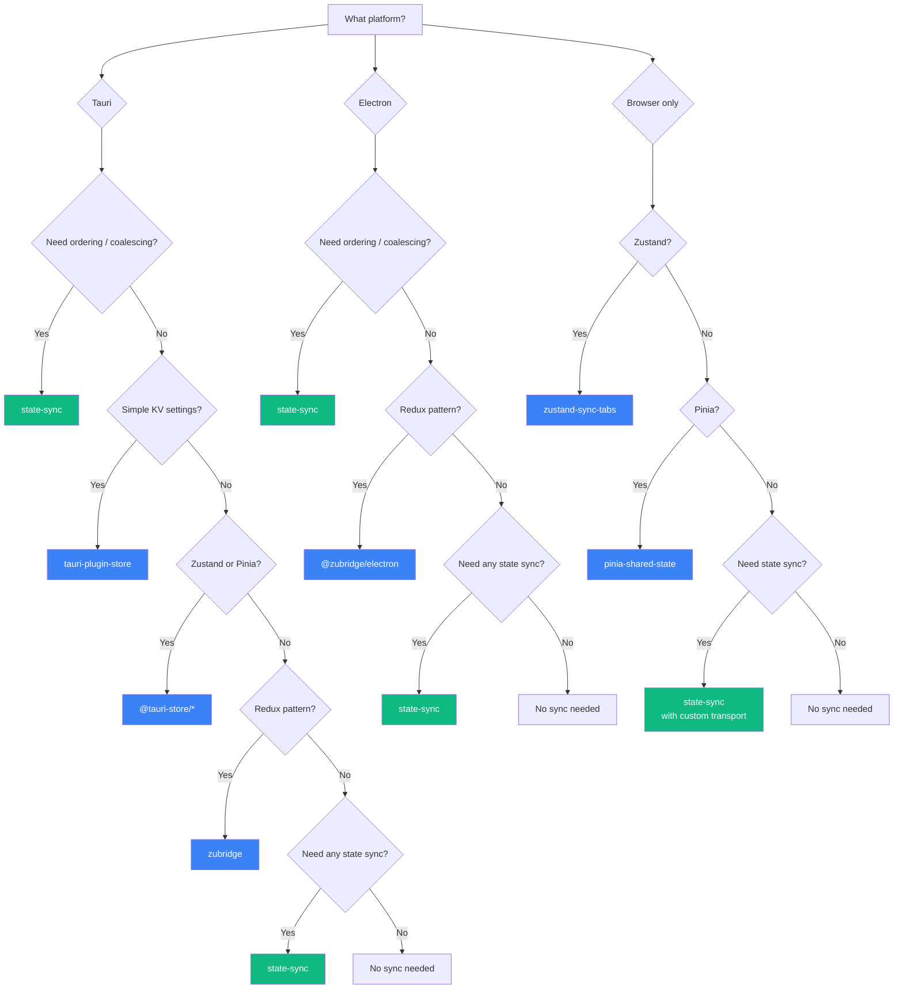

---

## Links

### Tauri
- [@tauri-store/zustand](https://github.com/ferreira-tb/tauri-store) — Zustand + Tauri persistence
- [tauri-plugin-store](https://v2.tauri.app/plugin/store/) — Official Tauri KV storage
- [zubridge (Tauri)](https://github.com/goosewobbler/zubridge) — Redux-like for Tauri

### Electron
- [@zubridge/electron](https://github.com/goosewobbler/zubridge) — Zustand/Redux bridge for Electron
- [reduxtron](https://github.com/vitordino/reduxtron) — Minimal Redux bridge for Electron
- [electron-shared-state](https://github.com/zoubingwu/electron-shared-state) — Immer patch-based shared state

### Browser
- [zustand-sync-tabs](https://github.com/react18-tools/zustand-sync-tabs) — Zustand tab sync
- [pinia-shared-state](https://github.com/wobsoriano/pinia-shared-state) — Pinia tab sync

### CRDT (collaborative editing)
- [Yjs](https://github.com/yjs/yjs) — CRDT for collaborative editing
- [Automerge](https://automerge.org/) — CRDT library
- [TinyBase](https://tinybase.org/) — Reactive store with CRDT

## See also

- [Benchmarks](/benchmarks) — real IPC latency and coalescing efficiency numbers
- [Quickstart](/guide/quickstart) — get started with state-sync
- [How state-sync works](/guide/protocol) — the invalidation-pull protocol
