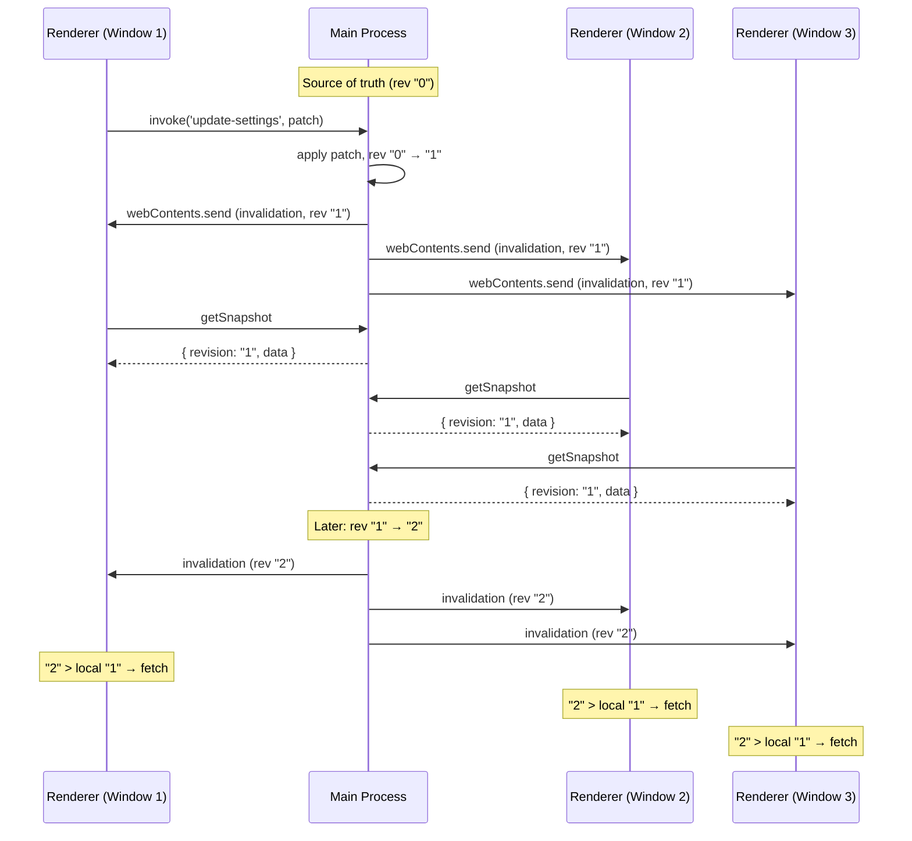

# How to Sync State Across Electron Windows

Sync state across all Electron windows using IPC — with any state manager on the renderer side.

You open a settings panel in a separate Electron window. Toggle dark mode. Close the window. The main window is still in light mode. Refresh — now it's dark. That one-second flicker, the stale UI, the "just refresh it" workaround — this is the multi-window state sync problem.

The core issue: Electron windows are isolated renderer processes. They don't share memory. Every piece of shared state — theme, language, user preferences — needs to cross the IPC bridge. Most teams end up with a tangle of `ipcMain.handle` / `webContents.send` calls that grow with every new piece of state.

This guide shows a structured approach: the main process is the single source of truth, renderers pull snapshots on demand, and a revision gate prevents stale updates. 3 runtime files, any state manager, all windows in sync.

::: tip
[View full source on GitHub](https://github.com/777genius/state-sync/tree/main/docs/examples) — `electron-main.ts`, `electron-preload.ts`, `electron-renderer.ts`
:::

## Project structure

```
your-electron-app/
├── src/
│   ├── main.ts          # Main process — state + broadcaster + snapshot handler
│   ├── preload.ts       # Bridge via contextBridge
│   ├── renderer.ts      # Zustand store + sync setup
│   └── window.d.ts      # Type declarations for window.statesync
├── index.html
├── package.json
└── tsconfig.json
```

## Installation

```bash
npm install @statesync/electron @statesync/core
```

Plus the adapter for your state manager (e.g. `@statesync/redux`, `@statesync/zustand`, `@statesync/pinia`, etc.).

## Architecture



All renderers receive every invalidation. The revision gate skips re-fetch only when the renderer already has the latest revision (e.g., two rapid invalidations where the first fetch already returned the latest state).

## Step 1: Preload

Electron isolates renderer processes from Node.js APIs for security. `contextBridge` safely exposes the sync bridge to renderer code — a single `exposeInMainWorld` call:

```typescript
// preload.ts
import { contextBridge, ipcRenderer } from 'electron';
import { createElectronBridge } from '@statesync/electron';

// State-sync bridge (invalidation + snapshot channels)
contextBridge.exposeInMainWorld(  // [!code focus]
  'statesync',                    // [!code focus]
  createElectronBridge(ipcRenderer), // [!code focus]
);                                // [!code focus]

// Write channel for renderer → main updates
contextBridge.exposeInMainWorld('api', { // [!code focus]
  updateSettings: (patch: Record<string, unknown>) => // [!code focus]
    ipcRenderer.invoke('update-settings', patch), // [!code focus]
}); // [!code focus]
```

::: warning contextBridge proxy identity
Electron's `contextBridge` wraps every function in a new proxy on each access. This breaks `ipcRenderer.removeListener()` because the callback reference changes. `createElectronBridge()` solves this by returning an unsubscribe closure that captures the original listener reference in preload scope.
:::

::: warning Security note
The bridge exposes `invoke()` for arbitrary IPC channels. If your main process has `ipcMain.handle()` registrations for privileged operations, consider adding channel validation. See [Electron security docs](https://www.electronjs.org/docs/latest/tutorial/security) for best practices.
:::

## Step 2: Main process

The main process holds the source of truth. Two primitives wire it up:

```typescript
// main.ts
import { app, BrowserWindow, ipcMain } from 'electron';
import {
  createElectronBroadcaster,
  createElectronSnapshotHandler,
} from '@statesync/electron';

type AppSettings = { theme: 'light' | 'dark'; language: string; fontSize: number };
const ALLOWED_KEYS: ReadonlySet<string> = new Set<keyof AppSettings>(['theme', 'language', 'fontSize']);

let state: AppSettings = { theme: 'dark', language: 'en', fontSize: 14 };
let rev = 0;

// Broadcaster: push invalidation events to ALL windows // [!code focus]
const broadcaster = createElectronBroadcaster({ // [!code focus]
  topic: 'settings', // [!code focus]
  getTargets: () => BrowserWindow.getAllWindows().map(w => w.webContents), // [!code focus]
}); // [!code focus]

// Snapshot handler: respond to "give me latest state" requests // [!code focus]
const snapshotHandler = createElectronSnapshotHandler({ // [!code focus]
  topic: 'settings', // [!code focus]
  getSnapshot: () => ({ revision: String(rev), data: state }), // [!code focus]
  handle: ipcMain.handle.bind(ipcMain), // [!code focus]
  removeHandler: ipcMain.removeHandler.bind(ipcMain), // [!code focus]
}); // [!code focus]

// Write path: renderer → main via IPC // [!code focus]
ipcMain.handle('update-settings', (_event, patch: Record<string, unknown>) => { // [!code focus]
  const sanitized: Partial<AppSettings> = {}; // [!code focus]
  for (const [key, value] of Object.entries(patch)) { // [!code focus]
    if (ALLOWED_KEYS.has(key)) (sanitized as Record<string, unknown>)[key] = value; // [!code focus]
  } // [!code focus]
  state = { ...state, ...sanitized }; // [!code focus]
  rev++; // [!code focus]
  broadcaster.invalidate(String(rev)); // [!code focus]
  return { ok: true }; // [!code focus]
}); // [!code focus]

// Cleanup on app quit // [!code focus]
app.on('will-quit', () => { // [!code focus]
  snapshotHandler.dispose(); // [!code focus]
}); // [!code focus]
```

## Step 3: Renderer — any state manager

This is where it gets interesting. The renderer setup is **identical** regardless of the state manager — only the `applier` line changes.

::: code-group

```typescript [Redux]
// renderer.ts — Redux
import { createElectronRevisionSync } from '@statesync/electron';
import { createReduxSnapshotApplier, withSnapshotHandling } from '@statesync/redux';
import { store } from './store'; // configureStore({ reducer: withSnapshotHandling(rootReducer) })

const sync = createElectronRevisionSync({
  topic: 'settings',
  bridge: window.statesync,
  applier: createReduxSnapshotApplier(store, { omitKeys: ['isLoading'] }), // [!code highlight]
  onError(ctx) { // [!code focus]
    console.error(`[sync] phase=${ctx.phase}`, ctx.error); // [!code focus]
  }, // [!code focus]
});

await sync.start();

// Cleanup on page unload
window.addEventListener('beforeunload', () => sync.stop()); // [!code focus]
```

```typescript [Zustand]
// renderer.ts — Zustand
import { createElectronRevisionSync } from '@statesync/electron';
import { createZustandSnapshotApplier } from '@statesync/zustand';
import { useSettingsStore } from './stores/settings';

const sync = createElectronRevisionSync({
  topic: 'settings',
  bridge: window.statesync,
  applier: createZustandSnapshotApplier(useSettingsStore, { omitKeys: ['isLoading'] }), // [!code highlight]
  onError(ctx) { // [!code focus]
    console.error(`[sync] phase=${ctx.phase}`, ctx.error); // [!code focus]
  }, // [!code focus]
});

await sync.start();

// Cleanup on page unload
window.addEventListener('beforeunload', () => sync.stop()); // [!code focus]
```

```typescript [Pinia]
// renderer.ts — Pinia
import { createElectronRevisionSync } from '@statesync/electron';
import { createPiniaSnapshotApplier } from '@statesync/pinia';
import { useSettingsStore } from './stores/settings';

const store = useSettingsStore();

const sync = createElectronRevisionSync({
  topic: 'settings',
  bridge: window.statesync,
  applier: createPiniaSnapshotApplier(store, { mode: 'patch', omitKeys: ['isSaving'] }), // [!code highlight]
  onError(ctx) {
    console.error(`[sync] phase=${ctx.phase}`, ctx.error);
  },
});

await sync.start();
window.addEventListener('beforeunload', () => sync.stop());
```

```typescript [Valtio]
// renderer.ts — Valtio
import { createElectronRevisionSync } from '@statesync/electron';
import { createValtioSnapshotApplier } from '@statesync/valtio';
import { settingsState } from './stores/settings';

const sync = createElectronRevisionSync({
  topic: 'settings',
  bridge: window.statesync,
  applier: createValtioSnapshotApplier(settingsState, { pickKeys: ['theme', 'language', 'fontSize'] }), // [!code highlight]
  onError(ctx) {
    console.error(`[sync] phase=${ctx.phase}`, ctx.error);
  },
});

await sync.start();
window.addEventListener('beforeunload', () => sync.stop());
```

```typescript [Svelte]
// renderer.ts — Svelte (writable store)
import { createElectronRevisionSync } from '@statesync/electron';
import { createSvelteSnapshotApplier } from '@statesync/svelte';
import { settingsStore } from './stores/settings'; // writable(...)

const sync = createElectronRevisionSync({
  topic: 'settings',
  bridge: window.statesync,
  applier: createSvelteSnapshotApplier(settingsStore), // [!code highlight]
  onError(ctx) {
    console.error(`[sync] phase=${ctx.phase}`, ctx.error);
  },
});

await sync.start();
window.addEventListener('beforeunload', () => sync.stop());
```

```typescript [Vue]
// renderer.ts — Vue reactive
import { createElectronRevisionSync } from '@statesync/electron';
import { createVueSnapshotApplier } from '@statesync/vue';
import { settingsState } from './stores/settings'; // reactive({...})

const sync = createElectronRevisionSync({
  topic: 'settings',
  bridge: window.statesync,
  applier: createVueSnapshotApplier(settingsState), // [!code highlight]
  onError(ctx) {
    console.error(`[sync] phase=${ctx.phase}`, ctx.error);
  },
});

await sync.start();
window.addEventListener('beforeunload', () => sync.stop());
```

:::

Notice: the only line that differs is the `applier`. Everything else — topic, bridge, lifecycle — stays the same.

`sync.start()` subscribes to invalidation events and immediately fetches the initial snapshot, so the store is populated before the UI renders. Until `start()` resolves, the store holds its default values.

The `onError` callback receives a context with `phase` — possible values: `start`, `subscribe`, `refresh`, `getSnapshot`, `apply`. This tells you exactly where the failure occurred.

## Step 4: Write path — renderer to main

Renderers are read-only sync consumers, but they can trigger state changes via a separate IPC channel. This keeps the write path explicit — the main process receives the patch, filters allowed keys, and applies the change:

```typescript
// renderer.ts — write path (framework-agnostic)
await window.api.updateSettings({ theme: 'light' }); // [!code focus]
await window.api.updateSettings({ fontSize: 16 }); // [!code focus]
```

The call is the same regardless of state manager — `window.api.updateSettings()` is exposed via the preload bridge (Step 1) and handled by `ipcMain.handle('update-settings')` in the main process (Step 2). No direct store manipulation needed.

The flow: renderer calls `window.api.updateSettings()` → preload forwards via `ipcRenderer.invoke('update-settings')` → main process filters allowed keys, applies patch, increments revision, broadcasts invalidation → all renderers (including the caller) receive the update through the sync cycle.

## TypeScript setup

Declare the bridge type so `window.statesync` is typed:

```typescript
// src/window.d.ts
import type { ElectronStateSyncBridge } from '@statesync/electron';

declare global {
  interface Window {
    statesync: ElectronStateSyncBridge;
    api: {
      updateSettings: (patch: Record<string, unknown>) => Promise<{ ok: boolean }>;
    };
  }
}

export {};
```

## Testing

The [full example](https://github.com/777genius/state-sync/blob/main/docs/examples/electron-main.ts) creates two windows automatically. To test:

1. Start your Electron app (`npm start` or `electron .`)
2. Both windows open with the same initial state
3. In Window 1, call `toggleTheme()` → sends `invoke('update-settings', { theme: 'light' })`
4. Main process applies the patch, increments revision ("0" → "1"), broadcasts invalidation
5. Both windows receive invalidation → fetch snapshot → apply `{ theme: "light" }`

```
Window 1: invoke('update-settings', { theme: 'light' })
↓
Main: state.theme = "light", rev "0" → "1"
↓
Main: broadcasts invalidation (rev "1") to all windows
↓
Window 1: "1" > local "0" → fetches snapshot → applies { theme: "light" }
Window 2: "1" > local "0" → fetches snapshot → applies { theme: "light" }
```

Open DevTools in both windows to observe the sync cycle. The revision gate deduplicates bursts: if two rapid invalidations arrive (rev "1", rev "2"), but the first fetch already returns rev "2", the second invalidation is skipped ("2" is not newer than local "2").

## Key points

1. **3 runtime files**: preload (bridge), main (broadcaster + handler), renderer (sync) — plus a `.d.ts` for TypeScript

2. **Main is source of truth**: State lives in the main process; renderers pull snapshots for reads and send commands via IPC for writes

3. **Any state manager**: Swap the `applier` one-liner — Redux, Zustand, Pinia, Valtio, Svelte, or Vue

4. **Window lifecycle safe**: `createElectronBroadcaster` handles destroyed `webContents` gracefully — no crashes if a window closes mid-broadcast

5. **Revision gate**: During burst updates, renderers skip re-fetch when they already have the latest revision — no redundant IPC round-trips

## Production tips

For high-frequency state changes (sliders, real-time data), add throttling to limit how often renderers re-fetch:

```typescript
const sync = createElectronRevisionSync({
  topic: 'settings',
  bridge: window.statesync,
  applier: createZustandSnapshotApplier(useSettingsStore),
  throttling: { debounceMs: 50 }, // [!code focus]
  onError(ctx) {
    console.error(`[sync] phase=${ctx.phase}`, ctx.error);
  },
});
```

Other options worth knowing:

- **`throttling.throttleMs`** — max interval between re-fetches during sustained bursts
- **`shouldRefresh(event)`** — filter invalidation events before triggering a fetch (e.g., skip events from the current window)
- **`logger`** — structured logging with `debug`, `warn`, `error` for observability

## How does it compare?

Honest look at Electron state sync options:

| | @statesync/electron | electron-redux | @zubridge/electron | Custom IPC |
|---|:---:|:---:|:---:|:---:|
| **Multi-window sync** | IPC push | IPC push | IPC push | DIY |
| **State manager** | Any (adapter) | Redux | Zustand, Redux | Any |
| **Burst deduplication** | Revision gate | — | — | DIY |
| **TypeScript** | Native | Bundled types | Native | DIY |
| **Status** | Active | Stable (v2.0.0) | Active | You maintain it |

All three libraries use a centralized main process as source of truth — which inherently serializes writes and prevents conflicts. The difference is in how renderers handle rapid updates: `@statesync/electron` adds a revision gate so renderers skip redundant re-fetches during bursts (e.g., slider dragging or real-time data). `electron-redux` and `@zubridge/electron` push full state on every change, which is simpler but uses more IPC bandwidth.

::: tip Worth noting
`electron-store` is often mentioned in this context, but it's a **config persistence** tool, not a real-time sync solution. It uses file watching for cross-process change detection.

`electron-redux` and `@zubridge/electron` push state over IPC with built-in adapters for their supported state managers. `@statesync/electron` is a transport layer — bring any state manager through an adapter, including mixing frameworks across windows.
:::

## See also

- [@statesync/electron](/packages/electron) — transport adapter API
- [@statesync/redux](/packages/redux) — Redux adapter
- [@statesync/zustand](/packages/zustand) — Zustand adapter
- [@statesync/pinia](/packages/pinia) — Pinia adapter
- [@statesync/valtio](/packages/valtio) — Valtio adapter
- [@statesync/svelte](/packages/svelte) — Svelte adapter
- [@statesync/vue](/packages/vue) — Vue adapter
- [Multi-window patterns](/guide/multi-window) — cross-window architecture
