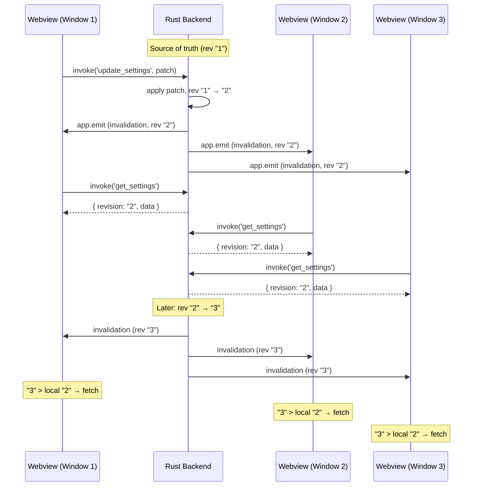

# How to Sync State Across Tauri Windows

Sync state across all Tauri windows using Rust IPC — with any state manager on the webview side.

You open a settings panel in a separate Tauri window. Toggle dark mode. Close the window. The main window is still in light mode. Refresh — now it's dark. That one-second flicker, the stale UI, the "just refresh it" workaround — this is the multi-window state sync problem.

The core issue: Tauri webviews are isolated processes. They don't share memory. Every piece of shared state — theme, language, user preferences — needs to cross the IPC bridge to the Rust backend. Most teams end up with a tangle of `invoke` / `emit` calls that grow with every new piece of state.

This guide shows a structured approach: the Rust backend is the single source of truth, webviews pull snapshots on demand, and a revision gate prevents stale updates. 2 runtime files, any state manager, all windows in sync. (For a side-by-side comparison with other Tauri sync libraries, see the [Tauri Ecosystem Comparison](/comparison#tauri-ecosystem).)

::: tip
[View full source on GitHub](https://github.com/777genius/state-sync/tree/main/docs/examples) — `tauri-backend.rs`, `tauri-frontend.ts`
:::

## Project structure

```
my-tauri-app/
├── src/
│   ├── sync/
│   │   └── settings-sync.ts  # Sync setup (framework-agnostic)
│   ├── stores/
│   │   └── settings.ts       # Your state manager store
│   └── App.vue / App.tsx
├── src-tauri/
│   ├── Cargo.toml
│   └── src/
│       └── lib.rs             # Rust backend — state + commands + events
├── package.json
└── tsconfig.json
```

## Installation

### Frontend

```bash
npm install @statesync/tauri @statesync/core
```

Plus the adapter for your state manager (e.g. `@statesync/redux`, `@statesync/zustand`, `@statesync/jotai`, `@statesync/mobx`, `@statesync/pinia`, `@statesync/valtio`, `@statesync/svelte`, `@statesync/vue`).

### Backend (Cargo.toml)

```toml
[dependencies]
state-sync = "0.1"
tauri = { version = "2", features = [] }
serde = { version = "1", features = ["derive"] }
```

## Architecture



All webviews receive every invalidation. The revision gate skips re-fetch only when the webview already has the latest revision (e.g., two rapid invalidations where the first fetch already returned the latest state).

## Step 1: Rust backend

::: tip No preload needed
Unlike Electron, Tauri does not require a preload script. Webviews call Rust commands directly via `invoke` — no `contextBridge`, no proxy identity issues, no extra file.
:::

```rust
// src-tauri/src/lib.rs
use std::sync::Mutex;
use tauri::{AppHandle, Emitter, State};
use serde::{Deserialize, Serialize};
use state_sync::{InvalidationEvent, Revision, SnapshotEnvelope};

#[derive(Clone, Serialize, Deserialize, Debug)]
#[serde(rename_all = "camelCase")]
pub struct Settings {
    pub theme: String,
    pub language: String,
    pub font_size: u32,
    pub notifications_enabled: bool,
    pub auto_save: bool,
    pub sidebar_collapsed: bool,
}

impl Default for Settings {
    fn default() -> Self {
        Self {
            theme: "system".to_string(),
            language: "en".to_string(),
            font_size: 14,
            notifications_enabled: true,
            auto_save: true,
            sidebar_collapsed: false,
        }
    }
}

pub struct AppState {
    pub settings: Settings,
    pub revision: Revision,
}

impl Default for AppState {
    fn default() -> Self {
        Self {
            settings: Settings::default(),
            revision: Revision::new(1),
        }
    }
}

#[tauri::command]
pub fn get_settings(state: State<'_, Mutex<AppState>>) -> SnapshotEnvelope<Settings> {
    let state = state.lock().unwrap();
    SnapshotEnvelope {
        revision: state.revision.to_string(),
        data: state.settings.clone(),
    }
}

#[tauri::command]
pub fn update_settings(
    app: AppHandle,
    state: State<'_, Mutex<AppState>>,
    settings: Settings,
) -> Result<SnapshotEnvelope<Settings>, String> {
    let mut state = state.lock().unwrap();

    state.settings = settings;
    state.revision = state.revision.next(); // [!code focus]

    let envelope = SnapshotEnvelope {
        revision: state.revision.to_string(),
        data: state.settings.clone(),
    };

    let event = InvalidationEvent { // [!code focus]
        topic: "settings".to_string(), // [!code focus]
        revision: state.revision.to_string(), // [!code focus]
    }; // [!code focus]

    app.emit("settings:invalidated", &event) // [!code focus]
        .map_err(|e| e.to_string())?; // [!code focus]

    Ok(envelope)
}

#[cfg_attr(mobile, tauri::mobile_entry_point)]
pub fn run() {
    tauri::Builder::default()
        .manage(Mutex::new(AppState::default()))
        .invoke_handler(tauri::generate_handler![
            get_settings,
            update_settings,
        ])
        .run(tauri::generate_context!())
        .expect("error while running tauri application");
}
```

## Step 2: Frontend — any state manager

This is where it gets interesting. The frontend setup is **identical** regardless of the state manager — only the `applier` line changes.

::: code-group

```typescript [Zustand]
// sync/settings-sync.ts — Zustand
import { createTauriRevisionSync } from '@statesync/tauri';
import { createZustandSnapshotApplier } from '@statesync/zustand';
import { listen } from '@tauri-apps/api/event';
import { invoke } from '@tauri-apps/api/core';
import { useSettingsStore } from '../stores/settings';

const sync = createTauriRevisionSync({
  topic: 'settings',
  listen,
  invoke,
  eventName: 'settings:invalidated',
  commandName: 'get_settings',
  applier: createZustandSnapshotApplier(useSettingsStore, { omitKeys: ['isLoading'] }), // [!code highlight]
  onError(ctx) { // [!code focus]
    console.error(`[sync] phase=${ctx.phase}`, ctx.error); // [!code focus]
  }, // [!code focus]
});

await sync.start();

// Cleanup on page unload
window.addEventListener('beforeunload', () => sync.stop()); // [!code focus]
```

```typescript [Redux]
// sync/settings-sync.ts — Redux
import { createTauriRevisionSync } from '@statesync/tauri';
import { createReduxSnapshotApplier, withSnapshotHandling } from '@statesync/redux';
import { listen } from '@tauri-apps/api/event';
import { invoke } from '@tauri-apps/api/core';
import { store } from '../stores/settings'; // configureStore({ reducer: withSnapshotHandling(rootReducer) })

const sync = createTauriRevisionSync({
  topic: 'settings',
  listen,
  invoke,
  eventName: 'settings:invalidated',
  commandName: 'get_settings',
  applier: createReduxSnapshotApplier(store, { omitKeys: ['isLoading'] }), // [!code highlight]
  onError(ctx) { // [!code focus]
    console.error(`[sync] phase=${ctx.phase}`, ctx.error); // [!code focus]
  }, // [!code focus]
});

await sync.start();

// Cleanup on page unload
window.addEventListener('beforeunload', () => sync.stop()); // [!code focus]
```

```typescript [Pinia]
// sync/settings-sync.ts — Pinia (call inside setup or after app.use(pinia))
import { createTauriRevisionSync } from '@statesync/tauri';
import { createPiniaSnapshotApplier } from '@statesync/pinia';
import { listen } from '@tauri-apps/api/event';
import { invoke } from '@tauri-apps/api/core';
import { useSettingsStore } from '../stores/settings';

export async function initSync() {
  const store = useSettingsStore();

  const sync = createTauriRevisionSync({
    topic: 'settings',
    listen,
    invoke,
    eventName: 'settings:invalidated',
    commandName: 'get_settings',
    applier: createPiniaSnapshotApplier(store, { mode: 'patch', omitKeys: ['isSaving'] }), // [!code highlight]
    onError(ctx) { // [!code focus]
      console.error(`[sync] phase=${ctx.phase}`, ctx.error); // [!code focus]
    }, // [!code focus]
  });

  await sync.start();
  window.addEventListener('beforeunload', () => sync.stop()); // [!code focus]
}
```

```typescript [Jotai]
// sync/settings-sync.ts — Jotai
import { createTauriRevisionSync } from '@statesync/tauri';
import { createJotaiSnapshotApplier } from '@statesync/jotai';
import { listen } from '@tauri-apps/api/event';
import { invoke } from '@tauri-apps/api/core';
import { getDefaultStore } from 'jotai';
import { settingsAtom } from '../stores/settings';

const jotaiStore = getDefaultStore();

const sync = createTauriRevisionSync({
  topic: 'settings',
  listen,
  invoke,
  eventName: 'settings:invalidated',
  commandName: 'get_settings',
  applier: createJotaiSnapshotApplier(jotaiStore, settingsAtom), // [!code highlight]
  onError(ctx) { // [!code focus]
    console.error(`[sync] phase=${ctx.phase}`, ctx.error); // [!code focus]
  }, // [!code focus]
});

await sync.start();
window.addEventListener('beforeunload', () => sync.stop()); // [!code focus]
```

```typescript [MobX]
// sync/settings-sync.ts — MobX
import { createTauriRevisionSync } from '@statesync/tauri';
import { createMobXSnapshotApplier } from '@statesync/mobx';
import { listen } from '@tauri-apps/api/event';
import { invoke } from '@tauri-apps/api/core';
import { runInAction } from 'mobx';
import { settingsStore } from '../stores/settings'; // observable({...})

const sync = createTauriRevisionSync({
  topic: 'settings',
  listen,
  invoke,
  eventName: 'settings:invalidated',
  commandName: 'get_settings',
  applier: createMobXSnapshotApplier(settingsStore, { runInAction }), // [!code highlight]
  onError(ctx) { // [!code focus]
    console.error(`[sync] phase=${ctx.phase}`, ctx.error); // [!code focus]
  }, // [!code focus]
});

await sync.start();
window.addEventListener('beforeunload', () => sync.stop()); // [!code focus]
```

```typescript [Valtio]
// sync/settings-sync.ts — Valtio
import { createTauriRevisionSync } from '@statesync/tauri';
import { createValtioSnapshotApplier } from '@statesync/valtio';
import { listen } from '@tauri-apps/api/event';
import { invoke } from '@tauri-apps/api/core';
import { settingsState } from '../stores/settings'; // proxy({...})

const sync = createTauriRevisionSync({
  topic: 'settings',
  listen,
  invoke,
  eventName: 'settings:invalidated',
  commandName: 'get_settings',
  applier: createValtioSnapshotApplier(settingsState, { pickKeys: ['theme', 'language', 'fontSize'] }), // [!code highlight]
  onError(ctx) { // [!code focus]
    console.error(`[sync] phase=${ctx.phase}`, ctx.error); // [!code focus]
  }, // [!code focus]
});

await sync.start();
window.addEventListener('beforeunload', () => sync.stop()); // [!code focus]
```

```typescript [Svelte]
// sync/settings-sync.ts — Svelte (writable store)
import { createTauriRevisionSync } from '@statesync/tauri';
import { createSvelteSnapshotApplier } from '@statesync/svelte';
import { listen } from '@tauri-apps/api/event';
import { invoke } from '@tauri-apps/api/core';
import { settingsStore } from '../stores/settings'; // writable(...)

const sync = createTauriRevisionSync({
  topic: 'settings',
  listen,
  invoke,
  eventName: 'settings:invalidated',
  commandName: 'get_settings',
  applier: createSvelteSnapshotApplier(settingsStore), // [!code highlight]
  onError(ctx) { // [!code focus]
    console.error(`[sync] phase=${ctx.phase}`, ctx.error); // [!code focus]
  }, // [!code focus]
});

await sync.start();
window.addEventListener('beforeunload', () => sync.stop()); // [!code focus]
```

```typescript [Vue]
// sync/settings-sync.ts — Vue reactive
import { createTauriRevisionSync } from '@statesync/tauri';
import { createVueSnapshotApplier } from '@statesync/vue';
import { listen } from '@tauri-apps/api/event';
import { invoke } from '@tauri-apps/api/core';
import { settingsState } from '../stores/settings'; // reactive({...})

const sync = createTauriRevisionSync({
  topic: 'settings',
  listen,
  invoke,
  eventName: 'settings:invalidated',
  commandName: 'get_settings',
  applier: createVueSnapshotApplier(settingsState), // [!code highlight]
  onError(ctx) { // [!code focus]
    console.error(`[sync] phase=${ctx.phase}`, ctx.error); // [!code focus]
  }, // [!code focus]
});

await sync.start();
window.addEventListener('beforeunload', () => sync.stop()); // [!code focus]
```

:::

Notice: the only line that differs is the `applier`. Everything else — topic, listen/invoke, event name, command name, lifecycle — stays the same.

`sync.start()` subscribes to invalidation events and immediately fetches the initial snapshot, so the store is populated before the UI renders. Until `start()` resolves, the store holds its default values.

The `onError` callback receives a context with `phase` — possible values: `start`, `subscribe`, `invalidation`, `refresh`, `getSnapshot`, `apply`, `protocol`, `throttle`. This tells you exactly where the failure occurred.

## Step 3: Write path — webview to Rust

::: warning Full struct replacement
The Rust `update_settings` command expects a **complete** `Settings` struct — not a partial patch. Always spread the current state and override only the changed fields. Sending a partial object will fail serde deserialization (missing fields = `400 Bad Request`). If you need partial patches, accept `Option<T>` fields in a separate Rust struct.
:::

Webviews are read-only sync consumers, but they can trigger state changes via a separate `invoke` call. This keeps the write path explicit — the Rust backend receives the settings, applies the change, and broadcasts:

```typescript
// Write path (framework-agnostic)
import { invoke } from '@tauri-apps/api/core';

// Read current state from your store (Zustand shown here)
const current = useSettingsStore.getState();

await invoke('update_settings', { // [!code focus]
  settings: { ...current, theme: 'dark' }, // [!code focus]
}); // [!code focus]
```

The call is the same regardless of state manager — `invoke('update_settings', ...)` calls the Rust command directly. Read current state from your store (`.getState()` for Zustand, `store.getState()` for Redux, `store.$state` for Pinia, etc.) and spread it with the changed field.

The flow: webview calls `invoke('update_settings')` → Rust mutates state, bumps revision, emits invalidation → all webviews (including the caller) receive the update through the sync cycle.

## TypeScript setup

Define a `Settings` interface that matches the Rust struct:

```typescript
// src/types/settings.ts
export interface Settings {
  theme: 'light' | 'dark' | 'system';
  language: string;
  fontSize: number;
  notificationsEnabled: boolean;
  autoSave: boolean;
  sidebarCollapsed: boolean;
}
```

Unlike Electron, Tauri does not require a `window.d.ts` declaration — there's no `contextBridge` proxy to type. Imports come directly from `@tauri-apps/api`.

## Testing

The [full example](https://github.com/777genius/state-sync/tree/main/docs/examples) creates two windows automatically. To test:

1. Start your Tauri app (`cargo tauri dev`)
2. Both windows open with the same initial state
3. In Window 1, change theme to "dark" → calls `invoke('update_settings', { settings: { ... } })`
4. Rust backend applies the patch, bumps revision ("1" → "2"), emits invalidation
5. Both windows receive invalidation → fetch snapshot → apply `{ theme: "dark" }`

```
Window 1: invoke('update_settings', { settings: { theme: 'dark', ... } })
↓
Rust: state.theme = "dark", rev "1" → "2"
↓
Rust: app.emit("settings:invalidated", { topic, revision: "2" })
↓
Window 1: "2" > local "1" → invoke('get_settings') → applies snapshot
Window 2: "2" > local "1" → invoke('get_settings') → applies snapshot
```

Open DevTools in both windows to observe the sync cycle. The revision gate deduplicates bursts: if two rapid invalidations arrive (rev "2", rev "3"), but the first fetch already returns rev "3", the second invalidation is skipped ("3" is not newer than local "3").

## Key points

1. **2 runtime files**: Rust backend (state + commands + events) and frontend sync setup — no preload layer needed

2. **Rust is source of truth**: State lives in the Rust backend; webviews pull snapshots for reads and send commands via `invoke` for writes

3. **Type-safe by design**: Rust's `serde` rejects malformed payloads at deserialization — no manual key filtering needed (unlike Electron's `ALLOWED_KEYS` pattern)

4. **Any state manager**: Swap the `applier` one-liner — Redux, Zustand, Jotai, MobX, Pinia, Valtio, Svelte, or Vue

5. **Revision gate**: During burst updates, webviews skip re-fetch when they already have the latest revision — no redundant IPC round-trips

## Production tips

For high-frequency state changes (sliders, real-time data), add throttling to limit how often webviews re-fetch:

```typescript
const sync = createTauriRevisionSync({
  topic: 'settings',
  listen,
  invoke,
  eventName: 'settings:invalidated',
  commandName: 'get_settings',
  applier: createZustandSnapshotApplier(useSettingsStore),
  throttling: { debounceMs: 50 }, // [!code focus]
  onError(ctx) {
    console.error(`[sync] phase=${ctx.phase}`, ctx.error);
  },
});
```

Other options worth knowing:

- **`throttling.throttleMs`** — max interval between re-fetches during sustained bursts
- **`shouldRefresh(event)`** — filter invalidation events before triggering a fetch (e.g., skip events from the current window)
- **`logger`** — structured logging with `debug`, `warn`, `error` for observability

## How does it compare?

Honest look at Tauri state sync options:

| | @statesync/tauri | @tauri-store | tauri-plugin-store | Custom invoke |
|---|:---:|:---:|:---:|:---:|
| **Multi-window sync** | IPC push | IPC push | IPC events | DIY |
| **State manager** | Any (8 adapters) | 5 frameworks | None (key-value) | Any |
| **Burst deduplication** | Revision gate | — | — | DIY |
| **Persistence** | — (add-on) | Built-in | Built-in | DIY |
| **TypeScript** | Native | Native | Native | DIY |
| **Status** | Active | Active | Stable | You maintain it |

All three libraries use a centralized Rust backend as source of truth — which inherently serializes writes and prevents conflicts. The difference is in how webviews handle rapid updates: `@statesync/tauri` adds a revision gate so webviews skip redundant re-fetches during bursts (e.g., slider dragging or real-time data). `@tauri-store` pushes state directly with built-in persistence and adapters for Zustand, Pinia, Valtio, Svelte, and Vue. `tauri-plugin-store` is a key-value config store — it broadcasts change events via IPC but has no revision ordering.

::: tip Worth noting
`tauri-plugin-store` is often mentioned in this context, but it's a **config persistence** tool, not a real-time sync engine. It stores key-value pairs on disk and broadcasts per-key change events to all webviews.

`@tauri-store` provides real-time sync with built-in persistence and supports 5 frameworks (Zustand, Pinia, Valtio, Svelte, Vue). `@statesync/tauri` is a transport layer — bring any of 8 state managers through an adapter, including Jotai, MobX, and Redux which `@tauri-store` does not cover.

This guide is written by the state-sync maintainer. For raw data and scoring methodology, see the [full comparison](/comparison#tauri-ecosystem).
:::

## See also

- [@statesync/tauri](/packages/tauri) — Tauri transport API
- [@statesync/redux](/packages/redux) — Redux adapter
- [@statesync/zustand](/packages/zustand) — Zustand adapter
- [@statesync/jotai](/packages/jotai) — Jotai adapter
- [@statesync/mobx](/packages/mobx) — MobX adapter
- [@statesync/pinia](/packages/pinia) — Pinia adapter
- [@statesync/valtio](/packages/valtio) — Valtio adapter
- [@statesync/svelte](/packages/svelte) — Svelte adapter
- [@statesync/vue](/packages/vue) — Vue adapter
- [Vue + Pinia + Tauri](/examples/vue-pinia-tauri) — complete Pinia example with Vue component
- [Multi-window patterns](/guide/multi-window) — cross-window architecture
- [Tauri Ecosystem Comparison](/comparison#tauri-ecosystem) — feature matrix and architecture ranking
