# Multi-window patterns

Best practices for syncing state across multiple browser tabs or Tauri windows.

## Architecture overview

```mermaid
graph TD
    A["🖥 Window A<br/><small>main</small>"]
    B["🖥 Window B<br/><small>settings</small>"]
    C["🖥 Window C<br/><small>popup</small>"]
    SOT["📦 Source of Truth<br/><small>Rust process / Main thread / API</small>"]

    SOT -- "invalidation event" --> A
    SOT -- "invalidation event" --> B
    SOT -- "invalidation event" --> C

    A -. "fetch snapshot" .-> SOT
    B -. "fetch snapshot" .-> SOT
    C -. "fetch snapshot" .-> SOT

    A -- "write" --> SOT
```



## Source of truth

**Rule:** One authoritative source per topic.

```typescript
// Backend (Rust/Node) holds the truth
// All windows fetch from it, never from each other

// Good: All windows sync from backend
const provider = {
  async getSnapshot() {
    return invoke('get_settings'); // Rust command
  }
};

// Bad: Windows syncing from each other
// This creates circular dependencies and race conditions
```

## Handling self-echo

When Window A updates state, it receives its own invalidation event. This is normal but can cause unnecessary refreshes.

### Option 1: Ignore via sourceId

```typescript
const windowId = crypto.randomUUID();

const sync = createRevisionSync({
  topic: 'settings',
  subscriber,
  provider,
  applier,
  shouldRefresh(event) {
    // Skip if this window originated the change
    return event.sourceId !== windowId;
  },
});
```

### Option 2: Let revision gate handle it

The engine automatically skips applying snapshots with the same or lower revision:

```typescript
// Window A: applies revision 5
// Window A: receives self-echo with revision 5
// Engine: skips (5 <= 5)
// No wasted refresh!
```

## Topic naming

Keep topics **domain-oriented**, not UI-oriented:

```typescript
// Good: Domain concepts
'auth-state' // [!code highlight]
'app-settings' // [!code highlight]
'user-preferences' // [!code highlight]

// Bad: UI concepts
'settings-window' // [!code error]
'main-window-state' // [!code error]
'popup-data' // [!code error]
```

## Example: Tauri multi-window

Each window runs its own sync handle. The Rust backend is the source of truth.

```typescript
import { createTauriRevisionSync } from '@statesync/tauri';
import { createPiniaSnapshotApplier } from '@statesync/pinia';
import { listen } from '@tauri-apps/api/event';
import { invoke } from '@tauri-apps/api/core';
import { useSettingsStore } from './stores/settings';

export function setupSettingsSync() {
  const store = useSettingsStore();

  const sync = createTauriRevisionSync({
    topic: 'settings',
    listen,
    invoke,
    eventName: 'settings:invalidated',
    commandName: 'get_settings',
    applier: createPiniaSnapshotApplier(store, { mode: 'patch' }),
  });

  sync.start();
  return () => sync.stop();
}
```

::: tip Full Tauri app
For the complete Rust backend + multi-window setup, see [Vue + Pinia + Tauri example](/examples/vue-pinia-tauri).
:::

## Browser tabs (BroadcastChannel)

For browser tab sync, use `@statesync/persistence` which handles BroadcastChannel automatically:

```typescript
import { createRevisionSync } from '@statesync/core';
import {
  createPersistenceApplier,
  createLocalStorageBackend,
} from '@statesync/persistence';

const storage = createLocalStorageBackend({ key: 'settings' });

const applier = createPersistenceApplier({
  storage,
  applier: innerApplier,
  crossTabSync: {
    channelName: 'settings-sync',
    receiveUpdates: true,
    broadcastSaves: true,
  },
});

// Now tabs automatically sync via BroadcastChannel
```

## Debugging multi-window issues

Enable debug logging to trace sync flow:

```typescript
import { createConsoleLogger, tagLogger } from '@statesync/core';

const windowId = new URLSearchParams(location.search).get('window') || 'main';

const logger = tagLogger(
  createConsoleLogger({ debug: true }),
  { windowId }
);

const sync = createRevisionSync({
  topic: 'settings',
  subscriber,
  provider,
  applier,
  logger, // Logs include windowId for each entry
});
```

Output:
```
[debug] [windowId=main] subscribed
[debug] [windowId=main] snapshot applied { revision: "5" }
[debug] [windowId=settings] subscribed
[debug] [windowId=settings] snapshot applied { revision: "5" }
```

## See also

- [Writing state](/guide/writing-state) — UI → backend write patterns
- [Custom transports](/guide/custom-transports) — build your own subscriber/provider
- [Vue + Pinia + Tauri example](/examples/vue-pinia-tauri) — full multi-window app
