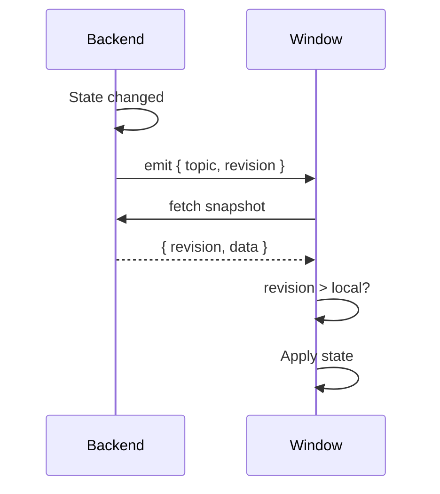

<div class="install-row">
  <InstallBlock />
  <div class="badges">
    <a href="https://www.npmjs.com/package/@statesync/core"></a>
    <a href="https://bundlephobia.com/package/@statesync/core"></a>
    <a href="https://github.com/777genius/state-sync/blob/main/LICENSE"></a>
    <a href="https://github.com/777genius/state-sync"></a>
  </div>
</div>

## Install

::: code-group
```bash [npm]
npm install @statesync/core
```
```bash [pnpm]
pnpm add @statesync/core
```
```bash [yarn]
yarn add @statesync/core
```
:::

<details>
<summary>Optional packages</summary>

```bash
# Persistence (caching, migrations, cross-tab sync)
npm install @statesync/persistence

# Framework adapter (pick one)
npm install @statesync/pinia    # Vue + Pinia
npm install @statesync/zustand  # React + Zustand
npm install @statesync/valtio   # React + Valtio
npm install @statesync/svelte   # Svelte
npm install @statesync/vue      # Vue (reactive/ref)

# Transport adapter
npm install @statesync/tauri    # Tauri v2
```

</details>

## Do you need state-sync?

**Yes, if you have:**

| Scenario | Problem state-sync solves |
|----------|---------------------------|
| Multi-window app (Tauri, Electron) | State diverges between windows |
| Multiple browser tabs | User edits in tab A, tab B shows stale data |
| Backend pushes state updates | Events arrive out of order, UI flickers |
| State must survive reload | Need persistence with proper invalidation |

**No, if you have:**

- Single-window app with no persistence needs
- Simple localStorage that never syncs with backend
- Already using a solution like TanStack Query for server state

## How it works



Stale updates are rejected. Rapid events are merged. State stays consistent. [Learn more →](/guide/protocol)

## Quick example

Sync a Zustand store across browser tabs with persistence:

```typescript
import { createRevisionSync } from '@statesync/core';
import { createZustandSnapshotApplier } from '@statesync/zustand';

// 1. Listen for "state changed" events from other tabs
const channel = new BroadcastChannel('my-sync');
const subscriber = {
  async subscribe(handler) {
    channel.onmessage = (e) => handler(e.data);
    return () => channel.close();
  },
};

// 2. Fetch current state
const provider = {
  async getSnapshot() {
    const raw = localStorage.getItem('my-state');
    return raw ? JSON.parse(raw) : { revision: '0', data: {} };
  },
};

// 3. Wire it together
const sync = createRevisionSync({
  topic: 'my-state',
  subscriber,
  provider,
  applier: createZustandSnapshotApplier(useMyStore),
});

await sync.start();
```

[Full Quickstart →](/guide/quickstart)
